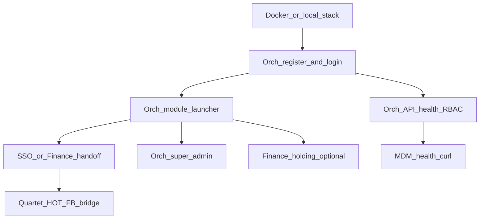

# Local UAT — gap checklist (launcher, auth, super-admin, holding, UI, MDM)

Living checklist for **«потыкать систему на локалке»**: what exists today vs product target.  
Not a delivery % score — use [`READINESS_MATRIX.md`](./READINESS_MATRIX.md) for API levels.

**Last updated:** 2026-05-26

**Last verified (P01):** 2026-05-26 — matrices refreshed via `delivery-readiness.mjs` + `readiness-coverage.mjs`.

**Related:** [SETUP_AND_RUN.md](./SETUP_AND_RUN.md) · [CONTROL_PLANE_ARCHITECTURE.md](./CONTROL_PLANE_ARCHITECTURE.md) · [SATELLITE_DOCUMENTATION.md](./SATELLITE_DOCUMENTATION.md) · [INTEGRATION_SSO_EVENTS.md](./INTEGRATION_SSO_EVENTS.md) (SP8 hybrid RBAC)

---

## Legend

| Symbol | Meaning |
|--------|---------|
| **Done** | Usable on localhost for manual UAT |
| **Partial** | Exists but incomplete vs target (gaps listed) |
| **Missing** | Not implemented |
| **N/A** | By architecture — not required on this app |

Columns: **Fin** · **Orch** · **Hot** · **FB** · **Ret** · **Log** · **Con** · **CRM** · **Auto** · **Cli** · **Who**

---

## 1. Platform entry & modules (launcher)

**Product model (SP9):** одна **главная точка входа** — **Orchestrator web** (`:3100` / `app.era.az`). Всё остальное — **модули подписки**, открываемые с домашней страницы Orch (не отдельные «лаунчеры» на сателлитах).

| Layer | What it is | Launcher host? |
|-------|------------|----------------|
| **Platform entry** | Orch web — login, org, billing snapshot, module grid | **Yes** (only) |
| **Finance module** | Data plane (GL, AR, holding, NAS) — tile on Orch home | Opened from Orch (URL tile) or deep link |
| **Industry modules (×9)** | Hotel, FB, Retail, … — `industry_*` entitlements | Opened from Orch via **SSO** (`/sso/callback`); local `/login` only for ops |

Сателлиты **Hot · FB · Ret · …** в этой секции **не колонки матрицы** — у них нет своего ecosystem launcher; см. §2.2 (SSO consumer + ops login).

| Capability | Orch (entry) | Finance module | Industry modules (×9) |
|------------|--------------|----------------|------------------------|
| Auth before module grid | **Done** | **N/A** (вход через Orch) | **N/A** |
| Entitlement-gated tiles (`industry_*` + Finance tile) | **Done** | **N/A** | **N/A** (entitlement checked on Orch) |
| Open module (SSO or URL) | **Done** | **Done** (JWT handoff `/auth/cp-handoff`) | **Done** (SSO callback on each app) |
| All modules in one UI | **Done** | — | — |

**Code**

| Piece | Path |
|-------|------|
| Orch home + industry | [`era-365-orchestrator/apps/web/app/page.tsx`](../era-365-orchestrator/apps/web/app/page.tsx), [`industry/[vertical]`](../era-365-orchestrator/apps/web/app/industry/[vertical]/page.tsx) |
| Shared module config | [`packages/satellite-kit/src/platform/industry-modules.ts`](../packages/satellite-kit/src/platform/industry-modules.ts) |
| Finance (no launcher) | `/industry/*` → redirect to Orch; sidebar Industry removed (SP9-2) |

**Local UAT:** Orch `http://localhost:3100` → login → module tile → **Open** (SSO for verticals, new tab for Finance). [QUARTET_UAT.md](./QUARTET_UAT.md) · `node scripts/sso-launch-smoke.mjs`.

---

## 2. Authentication & registration

### 2.1 Platform auth (Orch / Finance)

| Capability | Fin | Orch | Satellites |
|------------|-----|------|------------|
| Login | **Done** | **Done** (API) | **N/A** (use Finance/Orch) |
| Refresh token | **Done** | **Done** | **N/A** |
| Register user | **Redirect** → Orch | **Done** | **N/A** |
| Register organization (VÖEN) | **Redirect** → Orch | **Done** (MDM + membership) | **N/A** |
| Memberships / switch-org UI | **Done** (CP proxy) | **Done** (API) | **N/A** |
| Join org / team / transfer ownership | **Done** (proxy) | **Done** (API) | **N/A** |

Finance: `/login` (ERP session); `/register*`, `/settings/team` → redirect to Orch.  
Orch: `POST /auth/login`, `GET /memberships`, `POST /auth/switch-organization` — smoke: [UAT-SMOKE-RBAC.md](../era-365-orchestrator/doc/UAT-SMOKE-RBAC.md).

### 2.2 Satellite auth (per app)

| App | Local login | SSO `POST /api/auth/sso/exchange` | Local register | Ops roles (local DB) | Platform bar (Finance links) |
|-----|-------------|-----------------------------------|----------------|----------------------|------------------------------|
| **Hot** | **Done** | **Done** | **N/A** | **Done** (PMS roles) | **Done** |
| **FB** | **Done** | **Done** | **N/A** | **Done** (WAITER/MANAGER) | **Done** |
| **Ret** | **Done** | **Done** | **N/A** | **Done** | **Done** |
| **Log** | **Done** | **Done** | **N/A** | **Done** | **Done** |
| **Con** | **Done** | **Done** | **N/A** | **Done** | **Done** |
| **CRM** | **Done** | **Done** | **N/A** | **Done** | **Done** |
| **Auto** | **Done** | **Done** | **N/A** | **Done** | **Done** |
| **Cli** | **Done** | **Done** | **N/A** | **Done** | **Done** |
| **Who** | **Done** | **Done** | **N/A** | **Done** | **Done** |

**Gaps**

- [x] End-to-end **Orch → SSO → satellite** documented per app in each `UAT-SMOKE.md` (P2)
- [x] FB/Hotel: launcher SSO smoke in [QUARTET_UAT.md](./QUARTET_UAT.md) when `ERA_SSO_SHARED_SECRET` aligned
- [x] No satellite exposes `/register` — only Orch + Finance redirect (P7)

**Local UAT (ops):** `waiter`/`admin` from app `UAT-SMOKE.md`.  
**Local UAT (owner):** Orch login → module tile → SSO (not Finance sidebar).

---

## 3. Super-admin

| Capability | Fin Web | Orch API | Orch Web |
|------------|---------|----------|----------|
| Pricing / module catalog | **Redirect** → Orch | **Done** | **Done** (pricing/quotas/packages tabs) |
| Quotas / OCR limits | **Redirect** → Orch | **Done** | **Done** |
| Org security / disputes UI | **Redirect** → Orch | **Done** | **Done** (org lookup form) |
| MDM companies/counterparties UI | **Redirect** → Orch | **Done** (internal API) | **Done** (companies table) |
| Early-access admin | **Redirect** → Orch | **Done** | **Done** |
| NAS / i18n / reference data hub | **Done** (Finance GL) | **Partial** | **N/A** |
| `isSuperAdmin` gate | **Redirect** → Orch | **Done** | **Done** |

**Local UAT:** `http://localhost:3100/super-admin` with `isSuperAdmin` user. Finance `/super-admin` redirects to Orch ([ADR](./adr/orch-admin-shell.md)).

---

## 4. Holding structure (холдинг)

| Capability | Fin | Orch | Satellites |
|------------|-----|------|------------|
| `Holding` entity + members | **Done** | **Missing** | **N/A** |
| Attach org to holding | **Done** | **Missing** | **N/A** |
| Consolidated P&L / dashboard | **Done** (`/holding`, reporting) | **Missing** | **N/A** |
| Multi-org switcher (user memberships) | **Done** | **Done** (API) | **N/A** |

**Architecture note:** Holding is **financial consolidation**, not control-plane tenant identity. Orch JWT carries **one** `organizationId`; holding does not need to be duplicated on FB/Hotel.

**Closed (2026-05-26):** Holding is **Finance-only** for consolidated reporting. Orch does not model holdings; launcher has no «group of orgs» view.

**Local UAT:** Finance only — create holding, add orgs, open `/holding/[id]/dashboard`.

---

## 5. UI/UX — Finance pattern (tables + CRUD in modals)

Target: main screens = **lists/tables**; create/edit/delete = **`EraModal` / `ModalShell`** ([`DESIGN.md`](../DESIGN.md), [`@era/satellite-kit/ui`](../packages/satellite-kit/src/ui/index.ts)).

| App | DESIGN.md / satellite-kit UI | Modal-based CRUD (admin) | Sidebar / app shell | Finance-level density |
|-----|------------------------------|---------------------------|---------------------|------------------------|
| **Fin** | **Done** | **Done** | **Done** | **Done** (reference) |
| **Orch web** | **Partial** | **Partial** (early-access modal) | **Done** (`APP_SHELL_CLASS`, header nav) | **Partial** |
| **Hot** | **Done** | **Done** (`EraModal`) | **Done** | **Partial** (strong PMS, not ERP clone) |
| **FB** | **Partial** | **Partial** | **Partial** (nav only) | **Partial** (floor/KDS ops) |
| **Ret** | **Done** | **Partial** | **Partial** | **Partial** |
| **Log** | **Done** | **Partial** | **Partial** | **Partial** |
| **Con** | **Done** | **Partial** | **Partial** | **Partial** |
| **CRM** | **Done** | **Partial** | **Partial** | **Partial** |
| **Auto** | **Done** | **Partial** | **Partial** | **Partial** |
| **Cli** | **Done** | **Partial** | **Partial** | **Partial** (executive page) |
| **Who** | **Done** | **Partial** | **Partial** | **Partial** |

**Gaps (ecosystem-wide UI program)**

- [x] UI playbook doc: [`UI_PLAYBOOK_SATELLITES.md`](./UI_PLAYBOOK_SATELLITES.md) (P6)
- [ ] Audit each app admin routes: replace full-page forms with modals where Finance does (P06 in progress)
- [x] Orch web: `APP_SHELL_CLASS` + header nav + early-access modal

**Not a blocker** for API/smoke UAT; **is a blocker** for «ощущение одного продукта».

---

## 6. Global registry — MDM (companies & persons)

**Canonical host:** Orchestrator `era_mdm` — [`era-mdm-phase1.md`](../era-365-orchestrator/doc/adr/era-mdm-phase1.md)

| Capability | Orch API | Fin UI/API | Hot | FB | Ret | Log | Con | CRM | Auto | Cli | Who |
|------------|----------|------------|-----|-----|-----|-----|-----|-----|------|-----|-----|
| `GlobalLegalEntity` (VÖEN) | **Done** | **Done** (super-admin + counterparty adapter) | **Partial** | **Missing** | **Missing** | **Missing** | **Missing** | **Missing** | **Missing** | **Partial** | **Missing** |
| `GlobalNaturalPerson` | **Done** (API) | **Partial** | **Missing** | **Missing** | **Missing** | **Missing** | **Missing** | **Missing** | **Missing** | **Partial** | **Missing** |
| `globalPersonId` on domain records | — | — | **Done** (guest + MDM lookup) | **Missing** | **Missing** | **Missing** | **Missing** | **Missing** | **Missing** | **Done** | **Missing** |
| Org register via `mdm/organizations/register` | **Done** | **Partial** (Finance still has local register path) | — | — | — | — | — | — | — | — | — |
| Satellite calls Orch MDM for lookup | **N/A** | **Done** (Finance) | **Done** (person lookup API) | **Missing** | **Missing** | **Missing** | **Partial** | **Partial** | **Partial** | **Partial** | **Partial** |

**Clinic:** `PatientRef.globalPersonId`, sanatorium episodes.

**Hotel:** `Guest.globalPersonId` in Prisma + FIN lookup on new guest (P5).

**CRM / Finance boundary:** lead convert → Finance counterparty; no local MDM duplicate ([`era-crm-field/doc/clone-spec/01-finance-boundary.md`](../era-crm-field/doc/clone-spec/01-finance-boundary.md)).

**Gaps**

- [x] Finance org → MDM link on create (`ERA_MDM_REGISTER_VIA_ORCH`, `POST /internal/v1/mdm/organizations/link`)
- [x] Hotel guest ↔ `globalPersonId` + MDM lookup (`lookupGlobalPersonByFin`, `/api/mdm/person-lookup`)
- [ ] B2B VÖEN lookup component shared (Finance counterparty UX → satellites that need invoicing party)
- [ ] Citizen consent portal (Phase 2+)

**Local UAT MDM**

```bash
curl -s http://127.0.0.1:4100/internal/v1/mdm/health
# Finance UI: /super-admin/data/mdm/companies, .../counterparties
```

---

## 7. Platform RBAC consumer (SP8 — post-quartet)

| Capability | 7 SSO apps | Hot | FB |
|------------|------------|-----|-----|
| `PlatformSessionBarServer` | **Done** | **Done** | **Done** |
| `financeRole` in JWT (SSO) | **Done** | **Done** | **Done** |
| Executive / owner gating (`canViewExecutive`) | **Partial** (Ret, Cli) | **Done** (`/executive`) | **Done** (`/executive`) |
| Integration/billing admin (platform SSO only) | **Partial** | **Partial** | **Done** (FB integration API 403 without SSO) |
| Local join-org / memberships API | **N/A** | **N/A** | **N/A** |

---

## 8. Recommended local smoke order



| Step | Action | Pass criteria |
|------|--------|---------------|
| 1 | `docker compose up` or per-service dev | Health endpoints 200 |
| 2 | Orch `/register` + `/register-org` + login | JWT + org; `GET /v1/subscription/me` |
| 3 | `node scripts/quartet-smoke.mjs` | Orch/Fin/Hot/FB health |
| 4 | Orch launcher → Hotel / FB (SSO) | Module entitled or trial |
| 5 | Hotel `test-pos-bridge.mjs` + FB pay/room-charge | Bridge 201 |
| 6 | Orch `/super-admin` | Billing + MDM (Finance `/super-admin` redirects) |
| 7 | Orch `UAT-SMOKE-RBAC.md` curls | memberships, switch-org |
| 8 | Per-satellite `doc/UAT-SMOKE.md` | Domain flows |

---

## 9. Priority backlog (product)

| Priority | Item | Owner area |
|----------|------|------------|
| ~~P0~~ | Orch web launcher + SSO | **Done (SP9)** |
| ~~P1~~ | Super-admin UI (billing, MDM, early-access, security) | **Done (Post-SP9 P1)** |
| ~~P2~~ | SSO paths in each `UAT-SMOKE.md` | **Done (P2)** |
| ~~P3~~ | Finance JWT handoff | **Done (P3)** — [cp-finance-handoff ADR](./adr/cp-finance-handoff.md) |
| ~~P4~~ | Early-access modal on Orch | **Done (P4)** |
| ~~P5~~ | Hotel MDM guest lookup | **Done (P5)** |
| ~~P6~~ | UI playbook FB/Clinic/Who + Orch shell | **Done (P6)** |
| ~~P7~~ | Register audit, executive FB/Hot | **Done (P7)** |
| ~~SP7~~ | Seven industry modules depth | **Done (SP7)** — see DELIVERY SP7 sections |
| P01–P08 | ERA Program Orchestrator (UAT sync, CP2, addons Live) | **Done** — see `.cursor/plans/era_program_orchestrator_1fe445ab.plan.md` |

---

## 10. Refresh this checklist

When closing a gap:

1. Update the table cell to **Done** or **Partial** with a one-line note.
2. Tick the bullet under **Gaps**.
3. Update related `DELIVERY*.md` and optionally [READINESS_MATRIX.md](./READINESS_MATRIX.md) §2.1.
4. Run `node scripts/delivery-readiness.mjs` if DELIVERY checkboxes changed.

Skill: `era-readiness-matrix` for matrix sync.
