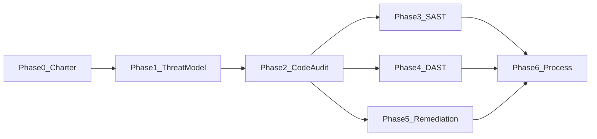

# ERA — Security & Hygiene Program

**Status:** Active SSOT (charter locked; audit/SAST/DAST/remediation execute from this file)  
**Language:** English (repo docs)  
**Does not replace:** [INTEGRATION_AUDIT_CI.md](./INTEGRATION_AUDIT_CI.md), [ERA-Acceptance-Standard](./products/ERA-Acceptance-Standard.md), product readiness matrices

This document is the **single source of truth** for the Security & Hygiene program: charter, threat model, code-audit waves, SAST/DAST plans, remediation waves, process hardening, findings backlog, and suppressions. Do **not** split backlog or baselines into separate files unless this program is explicitly superseded.

---

## Locked tooling (canon)

| Layer | Tool | When |
|-------|------|------|
| Secrets | gitleaks | PR + push `dev` / `master` |
| Dependencies | OSV-Scanner (fallback: `npm audit` per workspace) | PR; Critical/High **runtime** = block after tune-in |
| SAST | Semgrep (OWASP + TypeScript/JavaScript); ERA custom rules later | Workflow `security-sast.yml` (separate from `ci.yml` at first) |
| DAST | OWASP ZAP Automation Framework | Nightly / pre-pilot on lab compose |
| Existing (do not duplicate) | `npm run audit:integration:strict`, `npm run check:acceptance`, design-token lints | [`.github/workflows/ci.yml`](../.github/workflows/ci.yml) `packages` job |

---

## 0 — Charter

### Goal

Reduce AuthZ, tenancy, secrets, and supply-chain risk; capture recurring debt; close it in **per-core waves**. Not a monorepo rewrite.

### In scope

- [x] SSO / session / service-token AuthZ *(Wave A audit + R0/R1 partial remediations 2026-08-04)*
- [x] Multi-tenant filters and org binding (finance + satellites) *(Wave B/C audit; remediations ongoing)*
- [x] Money-path integrity (post, pay, fiscal, cash) *(Wave B findings logged; atomic claim fixes scheduled R2)*
- [x] Satellite IDOR and admin vs ops roles *(Wave C audit)*
- [x] Shared kit / contracts as attack-surface amplifiers *(assert-service-token + SSO v2)*
- [x] SAST in CI + DAST on lab/staging *(workflow + scripts landed; tune-in / required-for-merge pending)*
- [x] Findings backlog (Appendix A) with severity and wave

### Out of scope

- UI redesign, i18n sweeps, product feature waves
- «Optimize everything» without a measured hotspot
- Big-bang layering / rename across all satellites
- Emergency reset of a core to `origin/dev` for green CI ([era-no-emergency-reset](../.cursor/rules/era-no-emergency-reset.mdc))

### Anti-goals

| Anti-goal | Why |
|-----------|-----|
| Global refactor PR | Contamination, unreviewable diffs, CI thrash |
| PDF-only audit with no backlog IDs | Findings die |
| SAST required on day one without tune-in | Noise kills trust |
| DAST on production / real PII | Lab seed only |
| Greenwash SHIPPED for security flows | Acceptance honesty |

### Severity triage

| Sev | Meaning | Action |
|-----|---------|--------|
| **P0** | Exploit, data leak, cross-tenant money/PII break | Fix immediately (hotfix wave) |
| **P1** | Clear AuthZ/tenancy gap or missing gate | Schedule in next remediation wave |
| **P2** | Defense-in-depth / hygiene | Park; pull into R4/R5 if cheap |
| **P3** | Noise, style, speculative | Park or suppress (Appendix B) |

### Finding ID format

`SEC-<AREA>-<nn>` — e.g. `SEC-SSO-01`, `SEC-FIN-02`, `SEC-SAT-03`. Every remediation PR cites finding IDs. New IDs are appended in [Appendix A](#appendix-a--findings-backlog).

### Program exit (see also Appendix C)

- [ ] Threat matrix current
- [ ] All P0 closed; P1 scheduled or closed
- [ ] SAST required on PR → `dev` (after tune-in)
- [ ] DAST nightly or pre-pilot with auth fixtures
- [ ] Negative test or audit rule for each closed P0/P1 class
- [ ] No open «global refactor» — only wave IDs R0–R5

---

## 1 — Threat model

### 1.1 Assets

| Asset | Plane / location |
|-------|------------------|
| Org identity, membership, freeze / dispute | `era-orchestrator` |
| MDM PII (`GlobalNaturalPerson`, FIN / passport) | Orchestrator MDM DB |
| SSO payload / satellite session cookies | Orch + satellites (`packages/satellite-kit`) |
| Service tokens (`SATELLITE_EVENT_SERVICE_TOKEN`, MDM internal) | All planes |
| GL, cash, payroll, invoices | `era-finance-core` |
| FO folio / city ledger | `era-hotel-pms` |
| Clinical ops + cashier | `era-clinic` |
| Satellite event envelopes | `@era/contracts` + workers |

### 1.2 Scenarios (minimum set)

Fill **Control** / **Gap** during Phase 2; open Appendix A rows when Gap ≠ none.

| ID | Scenario | Expected control | Control | Gap | Finding |
|----|----------|------------------|---------|-----|---------|
| T01 | Local staff escalate to OrgOwner / admin | Role separation; SSO-only owner paths | partial | RolesGuard OWNER collapse; PSA allowlist defaults | SEC-CP-02, SEC-SSO-04 |
| T02 | SSO HMAC forge / replay / wrong `organizationId` | Signed payload + expiry + org bind | partial | Replay (no jti); v2 role HMAC shipped; membership mint shipped | SEC-SSO-01, SEC-SSO-02✓, SEC-SSO-03✓, SEC-SSO-05✓ |
| T03 | Leaked service token writes events / MDM | Bearer required; rotate; least privilege | partial | Shared token; BFF now requires caller JWT | SEC-TOK-02✓, SEC-TOK-03 |
| T04 | Cross-tenant read/write (missing `organizationId`) | Prisma tenant extension / SQL filter | partial | Raw SQL + workers without ALS | SEC-FIN-05, SEC-FIN-06 |
| T05 | Satellite stores PII despite MDM link | No duplicate FIN/passport; integration audit | partial | Guest PII + passport in refCode | SEC-HOT-04, SEC-CLI-05 |
| T06 | IDOR on visit / reservation / invoice by id | Session + ownership / org checks | partial | One-deploy=one-org mitigates; admin API AuthZ holes | SEC-HOT-03, SEC-CLI-04 |
| T07 | Double-post payroll / cash / fiscal | Idempotency + `$transaction` | missing | Cash/payroll/advance TOCTOU | SEC-FIN-02, SEC-FIN-03, SEC-FIN-04, SEC-FIN-07 |
| T08 | Unauthenticated mutation on «internal» route | Guard / Bearer in production paths | partial | Prod fail-closed + dispatch token required | SEC-TOK-01✓, SEC-FIN-01✓, SEC-SAT-01✓, SEC-HOT-01✓, SEC-CLI-01✓, SEC-HOT-02✓, SEC-CLI-02 |
| T09 | Secrets in git / docker volumes / logs | gitleaks; `.gitignore`; no prod wipe | partial | gitleaks workflow added; not yet required | SEC-TOK-01 (env), tooling |
| T10 | Dependency RCE in Next/Nest chain | OSV / npm audit gate | partial | osv-scanner workflow added; tune-in | — |
| T11 | Open redirect after SSO / login | Allowlist redirect targets | present | Callback hard-redirects `/` | — |
| T12 | XSS via admin catalogs / print / rich text | Encode; avoid unsafe HTML | unknown | Not deep-scanned this pass | — |

### 1.3 Control sources (read before coding fixes)

- [INTEGRATION_SSO_EVENTS.md](./INTEGRATION_SSO_EVENTS.md)
- [CONTROL_PLANE_ARCHITECTURE.md](./CONTROL_PLANE_ARCHITECTURE.md)
- [adr/org-operating-mode.md](./adr/org-operating-mode.md)
- [adr/cp-workforce-role-templates-and-security-admin.md](./adr/cp-workforce-role-templates-and-security-admin.md)
- [adr/control-plane-jwt-keys.md](./adr/control-plane-jwt-keys.md)
- [adr/satellite-mutation-audit.md](./adr/satellite-mutation-audit.md)
- [INTEGRATION_AUDIT_CI.md](./INTEGRATION_AUDIT_CI.md) / [MDM_IDENTITY_AUDIT.md](./MDM_IDENTITY_AUDIT.md)

---

## 2 — Code audit waves

**Rules:** evidence = path + line or test name; one finding ID per discrete gap; do not «fix adjacent WIP» in the same PR as the audit note.

### Wave A — Control plane & identity (P0 first)

**Targets:** `era-orchestrator`, `packages/satellite-kit` (auth/SSO), `packages/era-contracts`

- [ ] SSO sign/verify: expiry, org binding, no local-login for `sso:no-password`
- [ ] Role gates: SuperAdmin / OrgOwner / workforce security routes
- [ ] Internal routes: Bearer required on production write paths
- [ ] Org freeze / dispute mode honored on mutations
- [ ] Seat / licensing checks not bypassable by client flag
- [ ] Audit trail on security-admin mutations

### Wave B — Finance money & tenancy

**Targets:** `era-finance-core`

- [ ] Prisma tenant extension / raw SQL always org-scoped
- [ ] Cash PKO/RKO + payroll post atomic + idempotent
- [ ] Invoice pay / netting concurrency safety
- [ ] Global `ValidationPipe` whitelist / forbidNonWhitelisted
- [ ] No loose `any` on money API inputs
- [ ] BullMQ jobs carry tenant from payload (or documented global-only)

### Wave C — Industry satellites

**Order:** hotel → clinic → fnb / retail (then others as needed)

- [ ] Local auth vs SSO separation
- [ ] `ERA_SATELLITE_ORGANIZATION_ID` not spoofable from client
- [ ] IDOR on primary resources (reservation, visit, order, …)
- [ ] Event publish: auth + schema validation
- [ ] No FIN/passport columns when `globalPersonId` present (align with integration audit)
- [ ] `/admin/*` AuthZ vs ops roles

### Wave D — Shared packages & hygiene

**Targets:** `packages/satellite-kit`, `@era/contracts`, domain kits

- [ ] Half-shipped kit exports / dead UI helpers (contamination lesson)
- [ ] CatalogField / managed lists: no free-text bypass where catalog required
- [ ] Secrets / tokens / backup paths not in git
- [ ] `docker-data/` ignored; no prod volume wipe helpers
- [ ] Encoding / UTF-8 process noted (see [era-utf8-encoding](../.cursor/rules/era-utf8-encoding.mdc)) — not a finding factory

### Wave E — Docs honesty (short)

- [ ] Security-sensitive SHIPPED rows have UI path + negative path where required
- [ ] Edition `ga` / sell claims not based on COVERAGE alone
- [ ] Run `npm run check:acceptance` / `:strict` — do not reinvent acceptance scanners

**Wave exit:** Appendix A updated; top P0/P1 ranked; threat table Control/Gap filled for T01–T12.

---

## 3 — SAST pipeline

**Implementation note:** wire tools in a **later** PR. This section is the executable spec.

### 3.1 Secrets (first)

- Workflow step: gitleaks on PR + push to `dev` / `master`
- Fail on high-confidence secrets
- Suppressions only in [Appendix B](#appendix-b--sast--dast-suppressions) with expiry

### 3.2 Dependencies

- OSV-Scanner (or per-workspace `npm audit --omit=dev`)
- Policy: Critical/High in **runtime** deps = block after ~2 sprints tune-in; Moderate → Appendix A P2

### 3.3 Semgrep

- Rulesets: OWASP + JavaScript/TypeScript
- Grow custom rules from repeat Phase-2 patterns (e.g. `$queryRaw` without org bind heuristic; `dangerouslySetInnerHTML`; open redirect)
- Workflow file (planned): `.github/workflows/security-sast.yml`
- Do **not** bloat [`.github/workflows/ci.yml`](../.github/workflows/ci.yml) on day one
- Become **required** for merge to `dev` after one week of noise tuning

### 3.4 ERA-specific static

- Prefer extending [`scripts/run-integration-audits.mjs`](../scripts/run-integration-audits.mjs) for MDM/hub/workforce patterns already owned there
- New scanners only for repeatable AuthZ/route patterns not covered by integration audit

### 3.5 SAST checklist

- [x] `security-sast.yml` lands (gitleaks + Semgrep + OSV) — [`.github/workflows/security-sast.yml`](../.github/workflows/security-sast.yml)
- [ ] Tune-in week complete; false positives in Appendix B
- [ ] Branch protection: SAST required on `dev`
- [x] Local AuthZ smoke: `npm run security:authz-smoke` (lab up)

---

## 4 — DAST (lab / staging)

### 4.1 Stand

- Lab compose only; **no** production data
- Fixed seed users/roles: Ops local, OrgOwner (SSO or fixture), SuperAdmin, service token
- URL map: [ECOSYSTEM_URLS.md](./ECOSYSTEM_URLS.md)

### 4.2 Tooling

| Mode | Tool | Frequency |
|------|------|-----------|
| Baseline (passive + light active) | OWASP ZAP Automation Framework | Nightly or pre-pilot |
| AuthZ smoke | Scripted Playwright or curl suite | Nightly / pre-pilot |

### 4.3 AuthZ smoke scenarios (minimum)

- [ ] Unauth → admin/API → 401/403
- [ ] Ops session → OrgOwner route → 403
- [ ] Org A token → Org B resource → 403/404
- [ ] Invalid / expired SSO → reject
- [ ] Missing Bearer on internal write → 401
- [ ] Light XSS/SQLi probes on login + 2–3 search endpoints

### 4.4 Triage

Priority: auth failures and PII in responses. ZAP noise → Appendix B with rationale.

### 4.5 DAST checklist

- [x] Lab URL defaults documented in [`scripts/security/authz-smoke.mjs`](../scripts/security/authz-smoke.mjs) (see [ECOSYSTEM_URLS.md](./ECOSYSTEM_URLS.md))
- [x] ZAP AF config: [`scripts/security/zap-baseline.yaml`](../scripts/security/zap-baseline.yaml)
- [ ] AuthZ smoke script green on lab (run when stack is up)
- [ ] Nightly or pre-pilot job wired to ZAP + AuthZ smoke
- [ ] One sign-off run before next pilot claim

---

## 5 — Remediation waves

Not a global refactor. Format = **one defect class × 1–2 apps × PR stack × green CI** (same discipline as managed-lists).

| Wave | Focus | Exit criteria |
|------|-------|---------------|
| **R0** | Secrets, Critical deps, obvious unauth writes | 0 open Critical SAST; rotated tokens if exposed |
| **R1** | SSO / service-token / internal AuthZ | T02, T03, T08 closed or accepted with residual |
| **R2** | Finance tenancy + money atomicity | Related Appendix A P0/P1 closed + tests |
| **R3** | Satellite IDOR + admin AuthZ (hotel, clinic first) | Negative API tests |
| **R4** | Shared-kit hygiene (exports, contamination) | Kit checklist or lint |
| **R5** | Measured P2 / perf only | Optional; evidence of measurement |

### PR rules

1. Cite finding ID(s) in PR body
2. Add negative test **or** audit/Semgrep rule so the class cannot silently return
3. Update Appendix A status
4. Docs/ADR only if contract/behavior changes ([documentation-upkeep](../.cursor/rules/documentation-upkeep.mdc))
5. If MDM/hub/workforce touched: `npm run audit:integration:strict`
6. Acceptance closeout when sell/show or SHIPPED claims change ([quality-gates skill](../.cursor/skills/quality-gates/SKILL.md))
7. **No** emergency reset-to-remote; **no** drive-by unrelated UI

### Bans (repeat)

- Global rename / layering rewrite across satellites
- Squashing domain work to green CI
- Claiming Pilot / `ga` from SAST green alone

---

## 6 — Process hardening

| Mechanism | Action |
|-----------|--------|
| CI | SAST required after tune-in; DAST nightly or pre-pilot |
| PR template | Security impact checkbox: AuthZ / money / tokens / tenancy |
| Agent skills | Prefer [quality-gates](../.cursor/skills/quality-gates/SKILL.md); follow this program for security waves |
| Acceptance | Security-sensitive SHIPPED needs negative path evidence |
| Quarterly | Revisit §1 threat matrix; shrink Appendix B |
| Pilot gate | R0–R1 closed (or accepted residual) **and** DAST sign-off before «можно показывать» security-sensitive claims |

### Ongoing checklist

- [x] PR template security checkbox — [`.github/PULL_REQUEST_TEMPLATE.md`](../.github/PULL_REQUEST_TEMPLATE.md)
- [ ] Branch protection includes SAST
- [ ] Quarterly threat revisit dated in Appendix C
- [ ] Pilot gate referenced from product readiness process

---

## Appendix A — Findings backlog

**SSOT for open/closed findings.** Audit pass 2026-08-04 (Waves A–C deep; D/E light). `✓` in Status = remediated in-repo this program run.

| ID | Sev | App | Class | Evidence | Wave | Status | Owner |
|----|-----|-----|-------|----------|------|--------|-------|
| SEC-TOK-01 | P0 | orch | Service token fail-open | `internal-service-token.util.ts`; `satellite-events.service.ts` | R0 | closed ✓ | — |
| SEC-TOK-02 | P0 | orch-web | BFF injects MDM token unauth | `apps/web/app/api/cp-mdm/**`; `platform/mdm/workforce/**` | R0 | closed ✓ | — |
| SEC-SSO-02 | P0 | orch / kit | Unsigned SSO `financeRole` | HMAC v2 + `resolveVerifiedSsoFinanceRole` | R1 | closed ✓ | — |
| SEC-SSO-03 | P0 | orch | Ticket org spoof / default OWNER | `createSatelliteSsoTicket` membership check | R1 | closed ✓ | — |
| SEC-SAT-01 | P0 | satellites / kit | Public event dispatch + client org | `events/dispatch` + `assertEnvServiceToken` | R0 | closed ✓ | — |
| SEC-HOT-01 | P0 | hotel / fnb / clinic | Bridge secret fail-open | `integration/staff-provision` | R0 | closed ✓ | — |
| SEC-CLI-01 | P0 | clinic | Bridge secret fail-open from-stay | `sanatorium/episodes/from-stay` | R0 | closed ✓ | — |
| SEC-HOT-02 | P0 | hotel | Default cron secret | `admin/reports/email-cron` | R0 | closed ✓ | — |
| SEC-FIN-01 | P0 | finance | Internal token fail-open | `InternalServiceTokenGuard` | R0 | closed ✓ | — |
| SEC-SSO-05 | P1 | satellites | Ticket org ≠ deploy org | SSO exchange bind to `ERA_SATELLITE_ORGANIZATION_ID` | R1 | closed ✓ | — |
| SEC-SSO-01 | P1 | orch / kit | SSO replay (no jti) | satellite exchange vs finance handoff Redis | R1 | open | — |
| SEC-SSO-04 | P1 | kit | PSA allowlist / default password | `platform-super-admin.ts` | R1 | open | — |
| SEC-TOK-03 | P1 | orch | Shared event/MDM token | alias chain | R1 | open | — |
| SEC-CP-01 | P1 | orch | Entitlement body `isSuperAdmin` | `entitlements.service.ts` | R1 | open | — |
| SEC-CP-02 | P1 | orch | RolesGuard OWNER→billing.manage | `roles.guard.ts` | R1 | open | — |
| SEC-CP-03 | P1 | orch | Org header without membership | `org-id.decorator.ts` | R1 | open | — |
| SEC-CP-04 | P1 | orch | Freeze not global on mutations | dispute/freeze only on transfer | R1 | open | — |
| SEC-FIN-02 | P0 | finance | Cash post double-journal | `cash-order.service.ts` FOR UPDATE + updateMany | R2 | closed ✓ | — |
| SEC-FIN-03 | P0 | finance | Payroll PAID double-journal | `payroll.service.ts` SENT→PAID claim | R2 | closed ✓ | — |
| SEC-FIN-04 | P0 | finance | Advance report double-post | `advance-report.service.ts` FOR UPDATE | R2 | closed ✓ | — |
| SEC-FIN-05 | P1 | finance | Raw SQL bypass tenant wrapper | unused `TenantPrismaRawService` | R2 | open | — |
| SEC-FIN-06 | P1 | finance | Workers skip tenant ALS | compliance/ocr/bank workers | R2 | open | — |
| SEC-FIN-07 | P1 | finance | Invoice payment race | `recordPayment` FOR UPDATE | R2 | closed ✓ | — |
| SEC-FIN-10 | P1 | finance | Payroll run DRAFT→POSTED race | `postRunSync` updateMany claim | R2 | closed ✓ | — |
| SEC-FIN-08 | P1 | finance | Network receive body not DTO | `NetworkDocumentPayload` type-only | R2 | open | — |
| SEC-CLI-02 | P0 | clinic | Public booking creates patients | `/api/booking` public POST | R3 | open | — |
| SEC-HOT-03 | P1 | hotel | Admin API without permission | maintenance / auto-bar | R3 | open | — |
| SEC-CLI-04 | P1 | clinic | LIS profiles admin without assert | `admin/lis-profiles` | R3 | open | — |
| SEC-HOT-04 | P1 | hotel | Guest PII + globalPersonId | `schema.prisma` Guest | R3 | open | — |
| SEC-CLI-05 | P1 | clinic | Passport in `refCode` | sanatorium.service | R3 | open | — |
| SEC-KIT-01 | P2 | kit | Half-exported UI / contamination | managed-lists lesson | R4 | open | — |

---

## Appendix B — SAST / DAST suppressions

| Tool | Rule / alert | Path or URL | Rationale | Expiry | Added |
|------|--------------|-------------|-----------|--------|-------|
| | | | | | |

Policy: no permanent suppressions without rationale and expiry. Prefer fixing code.

---

## Appendix C — Calendar & program DoD

### Suggested calendar

| Week | Focus |
|------|-------|
| W0 | §0 charter locked (this file) + §1 threat skeleton |
| W1 | §2 Waves A–B + start secrets/deps SAST (§3.1–3.2) |
| W2 | §2 Waves C–D + Semgrep tune-in (§3.3) |
| W3 | §4 DAST baseline + R0 fixes |
| W4+ | R1 → R3 remediation; R4 as residual |

### Program Definition of Done

- [x] §1 threat matrix Control/Gap filled for T01–T12
- [ ] Appendix A: all P0 closed; P1 closed or dated in a remediation wave *(R0/R1 token+SSO closed; finance/clinic P0 remain)*
- [ ] §3 SAST on PR → `dev` (required) *(workflow present; branch protection pending tune-in)*
- [ ] §4 DAST nightly or pre-pilot with auth fixtures *(scripts present)*
- [ ] Closed P0/P1 classes have negative test or audit/Semgrep rule *(AuthZ smoke covers subset)*
- [x] No standing «global refactor» initiative — only R0–R5
- [x] Index links from acceptance / integration audit docs remain valid

### Change log

| Date | Change |
|------|--------|
| 2026-08-04 | Initial SSOT: phases 0–6, appendices A–C, locked tools |
| 2026-08-04 | Full program pass: Waves A–C audit; R0/R1 remediations (tokens, BFF, SSO v2, dispatch, bridges); SAST workflow; DAST scripts; PR template; Appendix A filled |
| 2026-08-04 | R2 finance atomic claim: cash/payroll/advance/invoice FOR UPDATE + updateMany (SEC-FIN-02/03/04/07/10) |

---

## Related docs

| Doc | Role |
|-----|------|
| [INTEGRATION_AUDIT_CI.md](./INTEGRATION_AUDIT_CI.md) | MDM / hub / reference static gates |
| [INTEGRATION_SSO_EVENTS.md](./INTEGRATION_SSO_EVENTS.md) | SSO and satellite events |
| [ECOSYSTEM_URLS.md](./ECOSYSTEM_URLS.md) | Lab / local URLs for DAST |
| [products/ERA-Acceptance-Standard.md](./products/ERA-Acceptance-Standard.md) | Acceptance canon |
| [adr/org-operating-mode.md](./adr/org-operating-mode.md) | Tenancy / operating mode |
| [adr/cp-workforce-role-templates-and-security-admin.md](./adr/cp-workforce-role-templates-and-security-admin.md) | Workforce AuthZ |
| [adr/control-plane-jwt-keys.md](./adr/control-plane-jwt-keys.md) | JWT key handling |
| [adr/satellite-mutation-audit.md](./adr/satellite-mutation-audit.md) | Mutation audit expectations |
| [../.cursor/skills/quality-gates/SKILL.md](../.cursor/skills/quality-gates/SKILL.md) | Local quality gate commands |
| [../.cursor/rules/era-no-emergency-reset.mdc](../.cursor/rules/era-no-emergency-reset.mdc) | Ban reset-to-remote for CI |
| [../.cursor/rules/quality-tooling.mdc](../.cursor/rules/quality-tooling.mdc) | Agent tooling bans / gates |
