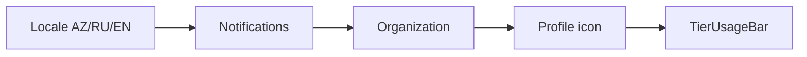

# UI playbook — industry satellites

Target: **list/table screens** + **modal CRUD** aligned with [DESIGN.md](../DESIGN.md) and `@era/satellite-kit/ui`.

**Design tokens (3-tier):** see [DESIGN.md - Three-tier design tokens](../DESIGN.md) and ADR [`era-design-tokens-3tier.md`](./adr/era-design-tokens-3tier.md). Use `resolveField` / `columnFilters` + `EraListFilterBar` on every table screen.

## Layout — app shell (canonical)

Authenticated routes use the **Finance-aligned shell** from `@era/satellite-kit/ui`:

| Piece | Component | Notes |
|-------|-----------|--------|
| Root body | `APP_SHELL_CLASS` | Full viewport, `#EBEDF0` background |
| Route wrapper | **`EraAppRouteShell`** | Mobile drawer, sidebar collapse, bare public paths |
| Header | **`EraAppHeader`** | Fixed top bar; slots for left cluster + right profile cluster |
| Sidebar | **`EraAppSidebar`** | **`17.5rem`** expanded; **`overflow-x-hidden`**; collapsible sections via `EraOpsSidebarSections` |
| Main | `EraOpsContent` inside shell | Padding = **`APP_MAIN_CONTENT_PADDED_CLASS`** (same as orch/finance `APP_MAIN_CONTENT_CLASS`); no `max-w-*` on ops screens |
| Platform links | `PlatformSessionBarServer` | Finance / Billing deep links only — **not** org name (org is in header) |

**Shell content padding — single source of truth**

| Token | Where |
|-------|--------|
| `APP_MAIN_CONTENT_PADDED_CLASS` | `packages/satellite-kit/src/ui/design-system.ts` |
| `APP_MAIN_CONTENT_CLASS` | orch `control-plane-shell`, finance `app-shell` (`<main>`) |
| `EraOpsContent` | all industry satellites via `EraAppRouteShell` |

Do **not** hard-code alternate `pt-*` / `py-*` on app mains. Change the kit token once.

Reference implementations:

| App | Shell file |
|-----|------------|
| Finance (reference) | `era-finance-core/apps/web/app/app-shell.tsx` + `MainHeader` / `MainSidebar` |
| Hotel (pilot) | `era-hotel-pms/src/components/HotelOpsShell.tsx` — FO routes: see [FRONT-OFFICE-ELECTRAWEB.md](../era-hotel-pms/doc/FRONT-OFFICE-ELECTRAWEB.md) |
| Retail / others | `src/components/*OpsShell.tsx` |

### Header right cluster (ERA / legacy ElektraWeb: read **right → left** = Profile → Organization → Bell → Locale)

DOM order (LTR): **Locale → Bell → Organization → Profile → TierBar** (`EraAppHeader` in `@era/satellite-kit`).



| Slot | Finance | Satellites |
|------|---------|------------|
| Locale | `LanguageSwitcher` (react-i18next) | **`SatelliteHeaderLocale`** — buttons **AZ**, **RU**, **EN** only |
| Filter menus | — | **`FilterMenuButton`** — 1–3 compact toolbar filters (grouping/period/horizon) |
| List filter panel | — | **`EraListFilterBar`** — multi-field filters under `PageHeader`; `Field`/`FieldSelect` labels on top; instant apply + inline Reset |
| Organization | `HeaderOrganizationSwitcher` (`variant="switcher"`) | `HeaderOrganization variant="label"` + `organizationName` from SSO/session |
| Notifications | `InAppNotificationBell` | **`SatelliteNotificationBell`** on Hotel + industry shells (Wave A/B) |
| Profile | `HeaderProfileMenu` | `HeaderProfileMenu` (avatar icon) + logout via `/api/auth/logout` |
| Tier bar | `HeaderSubscriptionStrip` → `HeaderTierUsageBar` | `useControlPlaneSubscription()` or app billing snapshot |

### Sidebar checklist

- [ ] Width **`w-[17.5rem]`** (kit default) — not legacy `w-56`
- [ ] **`overflow-x-hidden`** on aside + nav; long labels **`truncate`**
- [ ] Collapsible sections with chevron + auto-open on active route (hotel: `navSections`)
- [ ] **No** locale / user / logout in sidebar footer
- [ ] **No** create/add (`+`) or modal-only actions in sidebar — navigation links only
- [ ] Collapse toggle in sidebar header (desktop) — not a duplicate logout block

### Mobile

- Hamburger in `EraAppHeader` opens drawer; backdrop click closes
- Sidebar collapse (`4.5rem` rail) applies on **`lg+` only**

## List filters

| Mode | When | Component |
|------|------|-----------|
| Toolbar | 1–3 simple enums / horizon | `FilterMenuButton` in `PageHeader.actions` or ops toolbar |
| Panel | Search + 2+ fields | **`EraListFilterBar`** under `PageHeader`, then table card |

Rules: label **above** control (`Field` / `FieldSelect`); no placeholder-as-label; no filters mixed into table header cells; instant apply (debounce text ~300ms with `useDebouncedValue`); Reset inline on the filter row; i18n `common.filterReset` / `common.all`.

Reference: clinic `/patients`, `/admin/catalog`, `/admin/master-data`, `/lab-orders`, `/nurse`, `/sanatorium/resources`.

## List classes (pagination + layout)

| Class | When | Pattern |
|-------|------|---------|
| **A — Unbounded list** | Guests, reservations, patients, lab orders, sanatorium courses, CIF, invoices | Server `{ items\|data, total, page, pageSize }` + **`EraListWorkspace`** inside **`LIST_PAGE_SHELL_CLASS`** (`flex-1` under shell): filter / optional toolbar / scrollable table / docked `ListPaginationFooter` on the viewport bottom edge. Page itself does **not** scroll. |
| **B — Small catalog** | Master-data ≤~200 rows, modal grids | Client `EraDataGrid` (default slice + `DATA_TABLE_SCROLL_CLASS` 70vh) or `pagination={false}` |
| **C — Canvas** | Room plan, rack, POS, KDS, resource matrix | Not a paged table |

Contract helpers: `parsePaginatedList`, `normalizeListPagination`, `usePaginatedList` from `@era/satellite-kit` / `/ui`. Do **not** echo `page`/`pageSize` from the API into React state (pager snap races).

`EraDataGrid` defaults remain **client** + **flow** so unrefactored screens stay unchanged. Opt-in: `paginationMode="server"`, `layout="fill"`, `embedded` (table-only inside workspace). Class-A screens pair `embedded` + `paginationMode="server"` and prefer `usePaginatedList` + `parsePaginatedList`. FO reservations tint rows via `rowClassName` (status + notes ring).

## Managed pick-lists (`CatalogField`)

**Canon:** [adr/managed-lists-vs-enums.md](./adr/managed-lists-vs-enums.md) · Cursor rule `era-managed-list-controls.mdc`.

For taxonomy / tender / channel / catalog-code fields, **do not** use `Field` `shortText` / `code` or `<datalist>`. Pass a `CatalogFieldKind`; the kit picks the control:

| Kind | Control |
|------|---------|
| `CLOSED_SMALL` / `CLOSED_MEDIUM` | Select |
| `MULTI` | Checkbox group |
| `SEARCHABLE` / `ENTITY_REF` | Filterable combobox (Async API later) |
| `OPS_HOT` | Radio chips |
| `FREE_TEXT` | Text (only when intentionally free) |

```tsx
import { CatalogField, inferCatalogFieldKind } from "@era/satellite-kit/ui";

<CatalogField
  kind="CLOSED_SMALL" // or inferCatalogFieldKind({ optionCount: opts.length })
  label={t("market")}
  value={market}
  onChange={(v) => setMarket(String(v))}
  options={opts}
/>
```

Roadmap plans: `.cursor/plans/managed-lists-roadmap.plan.md`.

## CRUD pattern

1. **Index route** — table of entities, primary action “Add” opens modal
2. **Modal** — `ModalShell` + form; POST/PATCH to `/api/...`
3. **Delete** — confirm in modal footer (`ModalFooter`)
4. **No full-page create** for admin entities (ops flows like POS floor, Room Rack may stay full-screen)
5. **Large reservation modal (hotel):** `MODAL_FULL_CLASS` + `ModalShell` — single title/`subtitle`; `headerActions` + `footer` (`ReservationCardActions`); underline tabs via `TAB_*` tokens; folio lines on `HotelDataGrid` / `CHIP_*` subtabs. No nested second Close/title bar. Create and edit share one editor; post-save actions stay visible but disabled until saved.
6. **Modal dismiss (kit):** backdrop click and Esc do **not** close; exit only via Close / Cancel / footer. Body scroll is locked while open.

## Reference implementations

| App | Example |
|-----|---------|
| Finance | `apps/web/components/sales/modals/CreateCounterpartyModal.tsx` |
| Hotel | `src/components/EraModal.tsx`, `app/admin/master-data/page.tsx` |
| Retail (SP9 pilot) | `app/settings/page.tsx` — outlet name edit in modal |

## Checklist per app admin area

- [ ] Uses `CARD_CONTAINER_CLASS` + `DATA_TABLE_CLASS` tokens
- [ ] Create/edit in modal, not dedicated `/new` page
- [ ] Modal scalar fields use **`Field` / `FieldSelect` / `FieldTextarea` / `DatePicker`** with explicit **`preset`** from `@era/satellite-kit/ui` (see DESIGN.md § Field width taxonomy). **Dates:** `DatePicker` only — no bare `<input type="date">` (placeholder must be i18n).
- [ ] Related fields grouped in **`FieldRow`**; dense left rails use **`FieldSection`**
- [ ] Errors shown inline in modal (not alert)
- [ ] API/server errors on auth pages → **Sonner toast top-right** via `showApiError` from `@era/satellite-kit/ui` (no inline red text under fields)
- [ ] i18n keys if app has locale files
- [ ] Authenticated shell uses **`EraAppRouteShell`** (not legacy `EraOpsRouteShell` without header)

## Out of scope

- Copying full Finance ERP density to satellites (subscription locks, holdings tree in sidebar)
- Orch web super-admin (separate shell — see [orch-admin-shell.md](./adr/orch-admin-shell.md))

## Visual regression (design drift)

Golden modal screenshots live in `e2e/design-regression/snapshots/`. Run against local demo seed:

```bash
npm run bootstrap:local:demo
# start hotel :3201 + clinic :3203
npm run test:design-regression
npm run test:design-regression:update   # after intentional UI change — review PNG diff in PR
```

Nightly CI: [`.github/workflows/design-regression.yml`](../.github/workflows/design-regression.yml). PR CI runs token lint only (`npm run lint:design-tokens`).

Modal migration waves: [`FIELD_SYSTEM_MODAL_WAVES.md`](./FIELD_SYSTEM_MODAL_WAVES.md).

## Public auth pages (`/login`, `/register`)

Use **`AuthLoginCard`** / **`AuthRegisterCard`** / **`AuthPublicShell`** from `@era/satellite-kit/ui`. Product name belongs in `document.title` (`meta.title`), **not** in the card H1. Non-password public entry (F&B `/pin`, DBO OTP/ASAN) uses the same shell and header slots; identity/PIN fields replace password, not the header.

**Fixed slots** (do not insert copy between 1 and 3):

1. H1 **Giriş / Вход / Sign in** left + **`SatelliteLocaleToggle`** right (`AuthPageHeader`)
2. Identity field (staff: login / email / phone; platform/finance: email)
3. Password
4. ERA ID (`StaffLoginOrgNoField`) — staff SHARED only; placeholder 6 digits; **no hint paragraph**
5. Primary submit
6. Account / pricing / FAQ / terms links (`AuthLoginCard`; hide with `showAccountLinks={false}` on agency/buyer). Extra links (F&B PIN) go **after** that block via `extraLinks`, never between submit and “need account”.

**Forbidden on auth screens:** product H1, subtitle, demo passwords, bootstrap/`tmp/` paths, SSO essays, Super-admin/Workforce/dedicated pool hints, prefilled demo credentials.

Staff login reference: `era-clinic/app/login/page.tsx`. Do not regenerate pages with `tools/apply-auth-login-card.mjs` (middleware/schema only).

URLs: `orchPublicHref("/register")` etc. from **`@era/satellite-kit/ui`** only (not the main kit barrel).

## Error display (auth + API)

- Mount **`EraToastProvider`** or **`SatelliteAppProviders`** in app layout (Orch: `AppProviders` includes `EraToastProvider`).
- On failed login/register/API calls: **`showApiError(body, fallbackKey)`** — toast **top-right** only (preferred). `AuthLoginCard` / `AuthRegisterCard` may show a one-shot error banner above the form; do not add permanent subtitle/hint copy.
- Post-login navigation: **`assignNoStoreRedirect(url)`** from `@era/satellite-kit/ui` (not the main kit barrel).
- Do **not** use inline `text-red-600` under fields as the primary error UX.

## Scaffold tool

`node tools/apply-satellite-design-shell.mjs` — Tailwind + layout + `*OpsShell` template using `EraAppRouteShell`.
