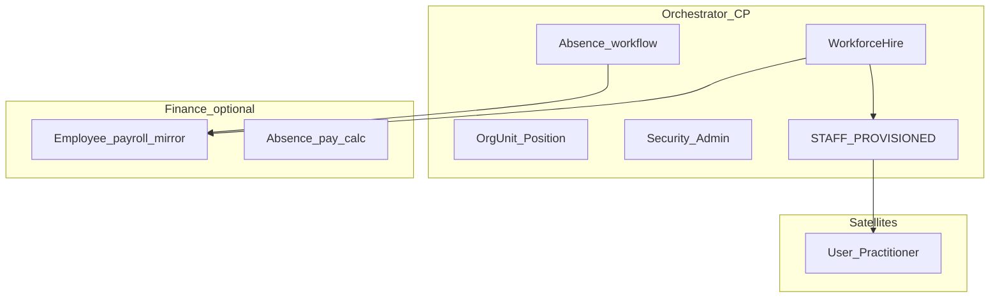

# ADR: Control-plane Core Workforce Hub (v3 MVP)

**Status:** Accepted (ERA v3 Plan E rollup)  
**Date:** 2026-06-16  
**Supersedes:** W3 dual-path hire modes (`finance_hr`, `local_master`) — see [workforce-identity-and-hr-provisioning.md](./workforce-identity-and-hr-provisioning.md)

## Context

ERA v3 moves operational workforce (hire, org structure, absence workflow, satellite access) to the **orchestrator control plane**. Finance retains **payroll** when `hr_full` is purchased. Plans A–D implement modules; Plan E removes legacy paths and ships integration.

## Decision — clean cutover (no strangler)

Empty DB / greenfield pilot: **delete** legacy hire paths in the same release wave. No dual-write, no Finance Employee → CP migration scripts.

## Module map (Plans A–D)

| Plan | CP capability | Finance (optional) | Satellites |
|------|---------------|-------------------|------------|
| **A** | Absence submit/approve | Mirror + payroll calc | — |
| **B** | OrgUnit + Position tree | Department/JobPosition mirror | — |
| **C** | Role templates, Security Admin, STAFF publisher | `WORKFORCE_EMPLOYMENT_HIRED` mirror | Login via provision |
| **D** | MDM batch ops-profile, PII tiers | Payroll-only Employee | T3 ops cache `fullName` |

## Single paths (locked)

| Concern | Master | Deprecated |
|---------|--------|------------|
| Hire | `/workspace/workforce` (CP) | Finance employee create + STAFF emit; clinic POST practitioners |
| Absence workflow | CP `/workspace/workforce/absences` | Finance absence CRUD |
| Org structure | CP OrgUnit/Position | Finance department CRUD |
| Person identity | MDM (Plan D) | Plaintext on Finance Employee / CP Employment |
| Satellite login | CP `WorkforceProvisionService` → `STAFF_PROVISIONED` | Finance `HrStaffProvisioningService` |

## Commercial SKU

- **`platform_workforce`** — CP Workforce Hub (included in default trial bundle for Nafta)
- **`hr_full`** — Finance payroll extension (optional)
- **`industry_*`** — satellite entitlements for role templates

Policy: `GET /platform/v1/workforce/policy` → `hireMode: cp_workforce | disabled`.

## Event catalog (direction)

| Event | Publisher | Consumer |
|-------|-----------|----------|
| `STAFF_PROVISIONED` / `STAFF_DEACTIVATED` | Orchestrator CP | clinic, hotel, fnb, … |
| `WORKFORCE_ABSENCE_*` | Orchestrator CP | Finance (mirror) |
| `WORKFORCE_EMPLOYMENT_HIRED` | Orchestrator CP | Finance (payroll stub) |
| `WORKFORCE_ORG_UNIT_*`, `WORKFORCE_POSITION_*` | Orchestrator CP | Finance (CostCenter mirror) |

## Architecture diagram

## Related ADRs

- [cp-workforce-absence-split.md](./cp-workforce-absence-split.md)
- [cp-workforce-org-units.md](./cp-workforce-org-units.md)
- [cp-workforce-role-templates-and-security-admin.md](./cp-workforce-role-templates-and-security-admin.md)
- [cp-workforce-pii-tiers.md](./cp-workforce-pii-tiers.md)

## Runbook

Onsite cutover: [v3-workforce-cutover.md](../runbooks/v3-workforce-cutover.md)

## Plan F extensions (post-MVP)

| Track | ADR |
|-------|-----|
| 1C / CSV export (Nafta without Finance) | [workforce-external-payroll-and-1c-export.md](./workforce-external-payroll-and-1c-export.md) |
| Construction timesheet bridge | [workforce-timesheet-construction-bridge.md](./workforce-timesheet-construction-bridge.md) |
| ƏMAS / e-qaimé boundary | [workforce-compliance-emas-boundary.md](./workforce-compliance-emas-boundary.md) |
| Seat licensing | [workforce-seat-licensing.md](./workforce-seat-licensing.md) |
| Dual audit | [workforce-dual-audit.md](./workforce-dual-audit.md) |

Additional events: `WORKFORCE_TIMESHEET_BATCH_IMPORTED`, `WORKFORCE_TIMESHEET_APPROVED`.
