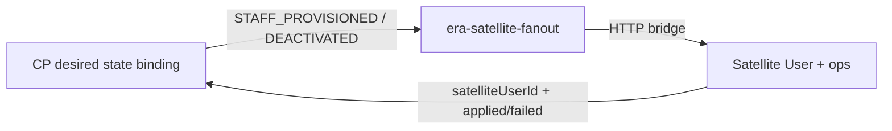

# ADR: CP workforce ↔ satellite provision sync

**Status:** Accepted (2026-09)  
**Context:** After login-hardening, `STAFF_DEACTIVATED` without `satelliteUserId` was a no-op; clinic/F&B ops cards could stay active after login revoke; Security bindings/grants UI paginated client-side over overview `take: 200`; fan-out failures were logs-only.

**Related:** [cp-workforce-role-templates-and-security-admin.md](./cp-workforce-role-templates-and-security-admin.md), [workforce-identity-and-hr-provisioning.md](./workforce-identity-and-hr-provisioning.md), [docs/INTEGRATION_SSO_EVENTS.md](../INTEGRATION_SSO_EVENTS.md)

## Decision summary

| Topic | Decision |
|-------|----------|
| Identity | `cpEmploymentId` = CP key; `satelliteUserId` = satellite principal for mutate |
| Deactivate without id | Prefer backfill + emit id when known; satellite **single-row** fallback by `{ organizationId, cpEmploymentId }` only; 0 → idempotent OK; >1 → `409 TARGET_AMBIGUOUS` |
| Ops sync | Auth (`User.status`) ≠ ops (`Practitioner.active` / F&B `StaffRoster.active`). On deactivate: disable User **and** ops linked by `userId` (clinic) or unique `cpEmploymentId` (F&B roster). Excel-only practitioners (`userId` null) stay untouched |
| Sync observability | `WorkforceRoleBinding.provisionState`: `PENDING` \| `APPLIED` \| `FAILED` (+ `lastProvisionError`, `lastProvisionAt`). CP is desired state; satellite is projection |
| Lists | Server `{ items, total, page, pageSize }`. `security/overview` is summary only — not list SoR |
| Login collision | CP assert + satellite `409 LOGIN_TAKEN`; fan-out marks binding `FAILED` |

## Desired state vs projection

- **CP** stores intended login/PIN and role bindings.
- **Fan-out** is async (`era-satellite-fanout`). UI Save & reprovision must not wait on satellite HTTP.
- Binding badge **Sync failed** + Reprovision = Retry after `FAILED` (e.g. race `LOGIN_TAKEN`).

## Deactivate target rules

1. CP always includes `satelliteUserId` in `STAFF_DEACTIVATED` when the ACTIVE binding has it.
2. If missing: set `provisionState=FAILED` / `MISSING_SATELLITE_USER_ID`, still enqueue with `cpEmploymentId` for fallback; log warn.
3. Satellite: `satelliteUserId` → else exactly one User by org+cp → else no-op / ambiguous.

Zod keeps `satelliteUserId` optional for queue backward compat; emit rule is mandatory when id is known.

## List pagination

Dedicated list APIs for bindings, manual grants, employments. Default `pageSize` 50, max 100 (same as audit). Absences/org-structure/positions full server rewrite is a follow-up (same contract).

## Consequences

- Migration adds provision columns on `workforce_role_bindings`.
- Worker patches `APPLIED`/`FAILED` after bridge.
- Nafta: migrate orch → deploy orch → hotel → clinic → fnb → reprovision bindings missing `satelliteUserId`.
