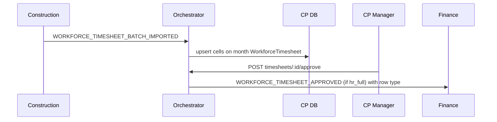

# ADR: Construction timesheet bridge (CP → Finance)

**Status:** Accepted (Plan F)  
**Date:** 2026-06-16  
**Updated:** 2026-08-31 — month header is the CP attendance SoR

## Context

`era-construction` timesheet CSV import wrote local rows only (`CN-CAL-02` HEADLESS). Ops also need a month × employee grid (Finance already had one). Two editable grids would diverge.

## Decision

**Control Plane is the only attendance master.** `WorkforceTimesheet` (`organizationId + year + month`) is the month header (`DRAFT | APPROVED`). Cells are `WorkforceTimesheetEntry` with `type` (`WORK | VACATION | SICK | OFF | BUSINESS_TRIP`) and `lockedFromAbsence`. Construction import upserts into that month (does not create duplicate days).

Finance is a **payroll mirror**, not a second editor: when the org has `platform_workforce`, Finance timesheet mutations (`autofill`, `batch`, `approve`, `sync-absences`) return **409 `TIMESHEET_MASTER_IS_CP`**. Finance UI shows only a banner + link to CP (no grid). `getOrCreate` remains writable so the event consumer can upsert.

- Construction `TimesheetEntry.cpEmploymentId` optional link.
- **Month approve only** (`POST …/timesheets/:id/approve`). Cherry-pick `POST …/approve` returns **410 `TIMESHEET_USE_MONTH_APPROVE`**.
- Empty month approve → **400** (autofill or enter attendance first).
- Cells with `status=APPROVED` or `lockedFromAbsence` are immutable; cancel absence unlocks overlapping DRAFT cells and restores weekday/weekend type. `sync-absences` reconciles orphan locks.
- Approve month emits `WORKFORCE_TIMESHEET_APPROVED` with optional row `type` (default `WORK` on consume).
- Finance consumer maps `type` onto payroll `TimesheetEntry` (not always WORK).

Without Finance: rows remain in CP + F1 CSV export.

## Events

| Event | Direction |
|-------|-----------|
| `WORKFORCE_TIMESHEET_BATCH_IMPORTED` | construction → orchestrator |
| `WORKFORCE_TIMESHEET_APPROVED` | CP → Finance (`hr_full`); payload `rows[].type` optional |
