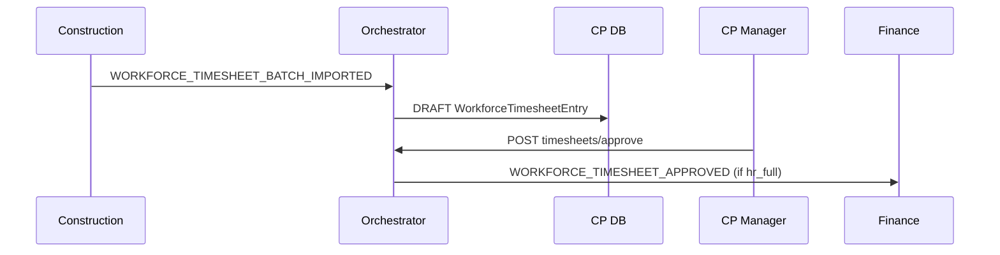

# ADR: Construction timesheet bridge (CP → Finance)

**Status:** Accepted (Plan F)  
**Date:** 2026-06-16

## Context

`era-construction` timesheet CSV import wrote local rows only (`CN-CAL-02` HEADLESS).

## Decision

- Construction `TimesheetEntry.cpEmploymentId` optional link.
- CP `WorkforceTimesheetEntry` master with DRAFT → APPROVED workflow.
- Finance consumer maps approved rows to payroll `TimesheetEntry` (WORK type).

Without Finance: rows remain in CP + F1 CSV export.

## Events

| Event | Direction |
|-------|-----------|
| `WORKFORCE_TIMESHEET_BATCH_IMPORTED` | construction → orchestrator |
| `WORKFORCE_TIMESHEET_APPROVED` | CP → Finance |
