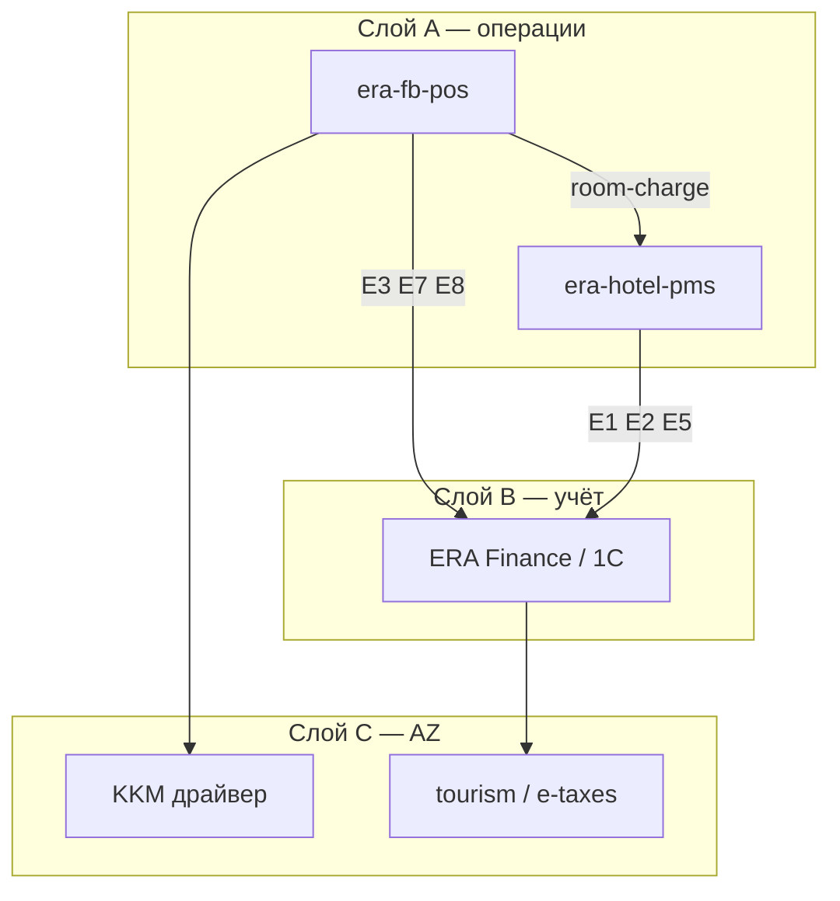

# 01. Архитектура и интеграции

## Место в ландшафте ERA

---

## Режимы развёртывания

| Режим | Описание |
|-------|----------|
| **Hotel-attached** | fb-pos + hotel-pms одна property; room-charge обязателен |
| **Standalone F&B** | Только fb-pos + ERP; PMS нет; оплата только cash/card |
| **Multi-outlet** | Несколько ресторанов в одной property; outlet_id в каждом чеке |

Один инстанс fb-pos = одна **property** (код отеля из `HOTEL_PROPERTY_CODE` или отдельный `OUTLET_PROPERTY_CODE`).

---

## Интеграция с era-hotel-pms

### Обязательные контракты (уже в PMS)

| Направление | Механизм | Документ |
|-------------|----------|----------|
| fb-pos → PMS | `POST /api/pos/room-charge` | [23-pos-bridge.md](../clone-spec/23-pos-bridge.md), OpenAPI [fb-pos-pms-bridge.yaml](../openapi/fb-pos-pms-bridge.yaml) |
| fb-pos → PMS | Auth: `POS_BRIDGE_SECRET` или service user JWT | `.env.example` |
| PMS → fb-pos | *Планируется:* `GET /api/pms/in-house-guests?query=` | §Ниже |
| PMS → fb-pos | *Планируется:* webhook «reservation checked out» → auto-close open room tickets | §Ниже |

### Room charge — payload (логический)

| Поле | Источник |
|------|----------|
| `reservationId` или `roomNumber` | Поиск гостя in-house |
| `revenueCode` | Outlet mapping (`FOOD`, `BAR`) |
| `amount` | Итог чека (или часть при split) |
| `description` | «Restaurant — Table T-12 — Ticket #…» |
| `outletCode` | `RESTAURANT`, `BAR` |
| `externalTicketId` | Idempotency key чека fb-pos |

**Правила:** только `IN_HOUSE`, folio `OPEN`, иначе ошибка официанту.

### Планируемые API PMS для fb-pos (спецификация, не реализовано)

| API | Назначение |
|-----|------------|
| `GET /api/pms/in-house` | Список: room, guest name, reservationId, folio balance hint — см. OpenAPI |
| `GET /api/pms/reservations/{id}/folio-summary` | Можно ли room charge, лимит кредита (опционально) |
| `POST /api/pms/pos-shift-block` | Сигнал «open POS shifts» для night audit (или polling из fb-pos) |

Реализация — в backlog hotel-pms при старте кода fb-pos.

Сквозной сценарий с примерами HTTP: [09-wireflow-ticket-to-folio.md](09-wireflow-ticket-to-folio.md).

---

## Интеграция с ERA Finance

| Событие | Когда | Payload (кратко) |
|---------|-------|------------------|
| **E3** `payment_received` | Оплата cash/card на кассе POS | amount, method, outlet, ticketId |
| **E7** `payment_fiscalized` | После KKM | receiptId, qrPayload |
| **E8** `stock_consumption` | Закрытие чека (если включено) | lines[]: sku, qty — **ERP списывает** |
| **E2** `invoice_issued` | B2B счёт на юрлицо (редко в зале) | через Finance, не блокер v1 |

Night audit **E1** — только из PMS после агрегации folio.

Outbound policy: [22-outbound-integration-policy.md](../clone-spec/22-outbound-integration-policy.md), каталог [erp-outbound-catalog.yaml](../openapi/erp-outbound-catalog.yaml).

---

## Интеграция со складом

**Nafta:** склад в ERP. fb-pos **не хранит** остатки.

| Шаг | Действие |
|-----|----------|
| 1 | При close ticket — расчёт consumption по recipe id из Finance (кэш меню) или локальный sku → event E8 |
| 2 | Finance проводит списание; отказ → лог + alert менеджеру (не блокировать оплату, policy) |

Флаг `ALLOW_SALE_WITHOUT_STOCK` — на стороне Finance.

---

## KKM (AZ)

Локальный адаптер в fb-pos (как mock в PMS для E7):

- Cash/card на месте → печать чека KKM
- Room charge → **без** KKM на столе (оплата при check-out / invoice в ERP — policy Nafta)

---

## Безопасность между сателлитами

| Механизм | Описание |
|----------|----------|
| `POS_BRIDGE_SECRET` | Shared secret PMS ↔ fb-pos |
| mTLS / IP allowlist | Prod опционально |
| Correlation id | На каждый ticket / room-charge |
| Idempotency-Key | Повтор room-charge не дублирует folio line |

---

## Технологический каркас (рекомендация при выносе в repo)

Не фиксируем жёстко в v0.1 спеки; ориентир как у hotel-pms:

- Next.js + Prisma + PostgreSQL (отдельная БД `era_fb_pos`)
- Redis — retry outbound
- Отдельный Docker compose profile `fb-pos`
- Общие conventions: envelope событий, property code, i18n en/ru/az

Детали — в [08-extraction-to-satellite-repo.md](08-extraction-to-satellite-repo.md).
