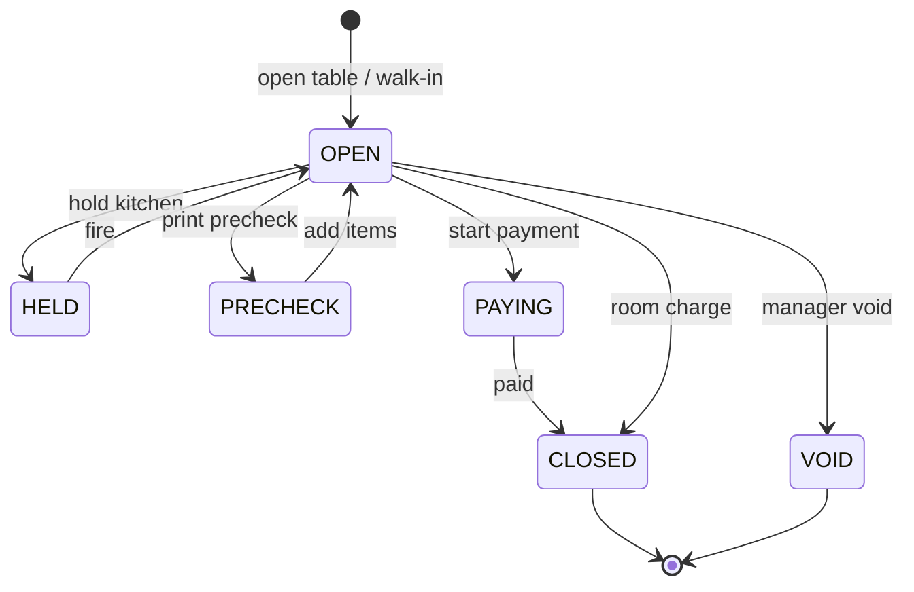

# 02. Доменная модель

## Иерархия

```
Property
 └── Outlet (ресторан, бар)
      ├── FloorPlan (опционально)
      │    └── Table
      ├── Menu (категории, items)
      ├── PosShift (смена кассы POS)
      └── Ticket (чек)
           └── TicketLine (+ modifiers)
```

---

## Сущности

### Outlet

| Поле | Описание |
|------|----------|
| code | `RESTAURANT`, `BAR`, `POOL_BAR` |
| name | RU/AZ/EN |
| revenueCenterCode | → revenue code default для outlet |
| departmentCode | → ERP department |
| active | |
| propertyCode | Связь с hotel property |

### Table (Resource)

| Поле | Описание |
|------|----------|
| code | `T-01` … |
| seats | Вместимость |
| zone | Зал / терраса |
| status | FREE, OCCUPIED, RESERVED, DIRTY |
| currentTicketId | nullable |

*SPA-кабинет — опциональный outlet type; для Nafta v1 не используем.*

### Menu structure

| Уровень | Описание |
|---------|----------|
| MenuCategory | Закуски, Основные, Напитки |
| MenuItem | plu, name, price, taxTag, recipeSku (ERP) |
| ModifierGroup | Соус, размер |
| Modifier | +2 AZN, без лука |

**Цены:** базовая валюта AZN; смена цен — effective date (фаза 2).

### Ticket (чек)

| Поле | Описание |
|------|----------|
| id | UUID |
| outletId, tableId | |
| status | см. ниже |
| waiterUserId | |
| covers | Кол-во гостей |
| reservationId | PMS link optional |
| guestName | walk-in text |
| roomChargeReservationId | при оплате на номер |
| openedAt, closedAt | |
| subtotal, discount, total | |
| externalRef | Для печати |

### TicketLine

| Поле | Описание |
|------|----------|
| menuItemId | |
| qty | |
| unitPrice | snapshot |
| modifiers[] | |
| kitchenStatus | NEW, FIRED, IN_PREP, DONE, VOID |
| notes | Комментарий кухне |
| voidReason | manager only |

### PosShift

| Поле | Описание |
|------|----------|
| cashier / outlet | |
| openedAt, closedAt | |
| status | OPEN, CLOSED |
| openingCash | |
| xReportAt | последний X |
| zReportData | json snapshot |

---

## Жизненный цикл чека (Ticket)



| Статус | Смысл |
|--------|--------|
| OPEN | Принимаются позиции |
| HELD | Позиции не ушли на KDS |
| PRECHECK | Пречек распечатан |
| PAYING | Экран оплаты |
| CLOSED | Оплачен или на номер |
| VOID | Аннулирован до закрытия |

---

## Жизненный цикл стола

| Переход | Условие |
|---------|---------|
| FREE → OCCUPIED | Открыт ticket |
| OCCUPIED → FREE | Ticket CLOSED/VOID |
| * → RESERVED | Бронь календаря |
| OCCUPIED → DIRTY | Policy после закрытия (опционально) |
| DIRTY → FREE | HK или официант |

---

## Split payment (логика)

| Тип | Описание |
|-----|----------|
| By amount | Часть суммы cash, часть card |
| By items | Разные гости — разные платежи |
| By guest count | Деление поровну |

Каждая часть → отдельный payment record; room charge — одна линия на PMS на итог гостя.

---

## Связь с PMS reservation

| Поле PMS | Использование в fb-pos |
|----------|------------------------|
| reservation.status = IN_HOUSE | Room charge allowed |
| guest.fullName | Поиск |
| room.roomNumber | Поиск |
| folio OPEN | Room charge allowed |

При check-out в PMS — fb-pos получает событие (план) и предупреждает о незакрытых room tickets.
