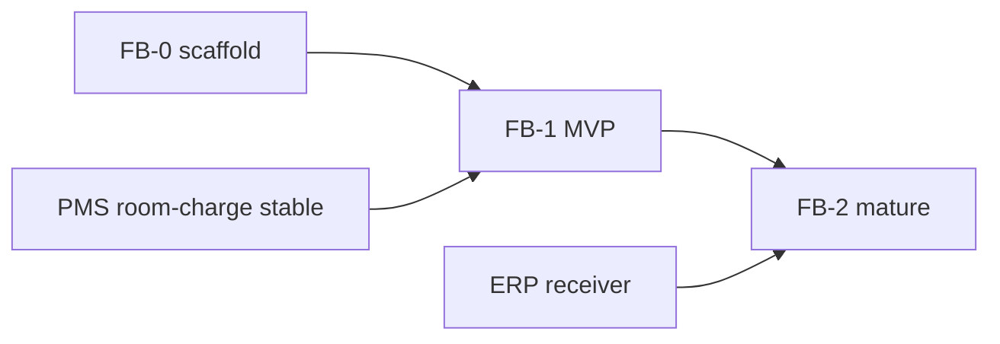

# 07. Фазы, delivery, user stories

## Критерии готовности продукта (G-FB)

| # | Критерий |
|---|----------|
| G-FB-1 | Карта зала + open/close ticket |
| G-FB-2 | Меню + модификаторы + KDS fire/done |
| G-FB-3 | Cash/card оплата + KKM mock |
| G-FB-4 | Room charge → hotel-pms folio (in-house) |
| G-FB-5 | POS shift Z + блок night audit в PMS |
| G-FB-6 | Outbound E3/E7 (+ E8 stub) в ERP |
| G-FB-7 | i18n en/ru/az |

---

## Фаза FB-0 — Каркас (1 спринт)

| Задача | Результат |
|--------|-----------|
| Repo scaffold | `era-fb-pos`, Docker, Prisma, auth |
| Outlet + Table + Menu seed | Admin CRUD |
| Integration client | room-charge → PMS (reuse contract) |
| DELIVERY.md | Tracker |

**Не делаем:** KDS, Z-report.

---

## Фаза FB-1 — MVP зала Nafta (2–3 спринта)

| Блок | Scope |
|------|--------|
| Floor map | Статусы, open ticket |
| Waiter order | Категории, lines, hold/fire |
| KDS v1 | Одна station HOT + BAR |
| Payment | Cash, card (mock KKM) |
| Room charge | PMS bridge |
| Pos shift | Open/X/Z, block open tickets on Z |

**User stories:**

| ID | История |
|----|---------|
| FB-01 | Официант открывает стол T-5, добавляет 2 блюда, fire на кухню |
| FB-02 | Повар отмечает DONE на KDS |
| FB-03 | Гость платит картой — KKM mock, ticket closed — [10-wireflow-cash-fiscal.md](10-wireflow-cash-fiscal.md) |
| FB-04 | Гость просит «на номер 201» — room charge, folio в PMS — [09-wireflow-ticket-to-folio.md](09-wireflow-ticket-to-folio.md) |
| FB-05 | Менеджер делает void строки с причиной |
| FB-06 | Закрытие смены Z при отсутствии open tickets |
| FB-07 | Night audit в PMS блокируется при open POS shift |

---

## Фаза FB-2 — Операционная зрелость (2 спринта)

| Блок | Scope |
|------|--------|
| Split bill | By item / equal |
| Transfer / merge table | |
| Calendar full | Бронь → ticket |
| PMS in-house API | Поиск гостей |
| Real KKM | NBC/Cybernet |
| E8 consumption | → ERP only |
| Reports | Waiter, category sales |

**User stories:**

| ID | История |
|----|---------|
| FB-08 | Split bill: половина cash, половина room |
| FB-09 | Хостес бронирует стол 19:00 → check-in → open ticket |
| FB-10 | ERP получает E8 после close ticket |

---

## Фаза FB-3 — Multi-outlet / standalone (backlog)

| Блок | Scope |
|------|--------|
| Несколько outlet в property | |
| Standalone mode без PMS | |
| Room service | |
| Offline queue | |
| Barcode / scale | |

---

## Зависимости

**Параллельно с hotel-pms:** UAT PMS + FB-0 scaffold.

---

## Что остаётся в hotel-pms (не переносить)

- Quick posting WA0135
- Medical contour
- Night audit orchestration
- Folio UI для просмотра charges с fb-pos
- Lite calendar (опционально read-only mirror)

---

## Оценка (грубо)

| Фаза | Календарь |
|------|-----------|
| FB-0 | 1–2 недели |
| FB-1 | 6–8 недель |
| FB-2 | 4–6 недель |
| FB-3 | по запросу |

Команда: 1–2 dev + дизайн floor/KDS по необходимости.

---

## OpenAPI (план)

При старте кода — `doc/openapi/fb-pos/`:

| Spec | Содержание |
|------|------------|
| `room-charge-client.yaml` | Client → PMS (consumer) |
| `in-house-guests.yaml` | PMS → fb-pos (planned) |
| `pos-shift-status.yaml` | fb-pos → PMS NA guard |
| `outbound-events.yaml` | fb-pos → ERP |

Шаблоны — в [08-extraction-to-satellite-repo.md](08-extraction-to-satellite-repo.md).
