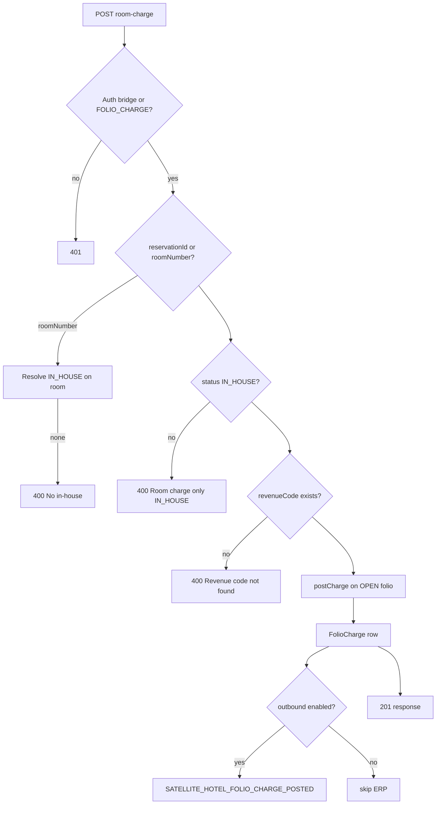

# 09. Wireflow: стол → KDS → room charge → folio

> Сквозной сценарий **одного чека** в режиме **Hotel-attached** (Nafta).  
> OpenAPI: [fb-pos-pms-bridge.yaml](../openapi/fb-pos-pms-bridge.yaml) · мост: [23-pos-bridge.md](../clone-spec/23-pos-bridge.md)

**Участники:**

| ID | Система |
|----|---------|
| W | Терминал официанта (era-fb-pos) |
| K | KDS (era-fb-pos) |
| F | era-fb-pos API / DB |
| P | era-hotel-pms |
| E | ERA Finance (ERP) |

**Предусловия:**

- В PMS: резервация `IN_HOUSE`, комната 201, folio `OPEN`.
- В fb-pos: outlet `RESTAURANT`, стол `T-12` = `FREE`, POS-смена `OPEN`.
- `POS_BRIDGE_SECRET` настроен на обеих сторонах.
- Revenue code `FOOD` есть в master PMS.

---

## Обзор (happy path)

```mermaid
sequenceDiagram
  autonumber
  participant W as Waiter UI
  participant F as fb-pos
  participant K as KDS
  participant P as hotel-pms
  participant E as ERP

  W->>F: Open PosShift (internal)
  W->>F: Open ticket @ T-12
  W->>F: Add lines + Fire kitchen
  F->>K: KDS tickets NEW→FIRED
  K->>F: Lines DONE
  W->>P: GET in-house?query=201
  P-->>W: reservationId, guestName
  W->>F: Link reservationId to ticket
  W->>F: Pay → Room charge
  F->>P: POST /api/pos/room-charge
  P->>P: FolioCharge + business rules
  P-->>F: 201 FolioCharge
  F->>F: Ticket CLOSED, table FREE
  P->>E: SATELLITE_HOTEL_FOLIO_CHARGE_POSTED
  Note over W,E: KKM на столе нет; фискал при check-out — policy Nafta
```

---

## Фаза A — Смена и открытие стола (только fb-pos)

### A1. Открытие POS-смены

| Шаг | Действие | API (fb-pos, internal) |
|-----|----------|-------------------------|
| A1.1 | Кассир/менеджер логин | `POST /api/auth/login` |
| A1.2 | Open shift, размен | `POST /api/pos/shifts` `{ outletCode, openingCash }` |
| A1.3 | *(planned)* Сигнал PMS | `PUT /api/pms/pos-shift-status` на PMS **или** PMS polling |

**Состояние:** `PosShift.status = OPEN`, outlet готов принимать чеки.

### A2. Открытие стола T-12

| Шаг | Действие | Результат в F |
|-----|----------|---------------|
| A2.1 | Официант выбирает стол T-12 (FREE) | — |
| A2.2 | `POST /api/tickets` | `Ticket.status = OPEN`, `tableId`, `waiterUserId`, `covers=2` |
| A2.3 | Table | `FREE → OCCUPIED`, `currentTicketId` set |

**Пример (логический JSON fb-pos):**

```http
POST /api/tickets HTTP/1.1
Host: fbpos.local
Content-Type: application/json

{
  "outletCode": "RESTAURANT",
  "tableCode": "T-12",
  "covers": 2,
  "posShiftId": "shift-uuid-001"
}
```

**Ответ `201`:**

```json
{
  "id": "a1b2c3d4-e5f6-7890-abcd-ef1234567890",
  "status": "OPEN",
  "tableCode": "T-12",
  "subtotal": 0,
  "total": 0,
  "openedAt": "2026-05-22T19:05:00.000Z"
}
```

---

## Фаза B — Заказ и KDS (только fb-pos)

### B1. Добавление позиций

| # | menuItem | qty | unitPrice | station |
|---|----------|-----|-----------|---------|
| 1 | Борщ | 2 | 8.00 | HOT |
| 2 | Чай | 2 | 3.00 | BAR |

```http
POST /api/tickets/a1b2c3d4-e5f6-7890-abcd-ef1234567890/lines HTTP/1.1

[
  { "menuItemPlu": "SOUP-01", "qty": 2, "notes": "" },
  { "menuItemPlu": "TEA-01", "qty": 2 }
]
```

`Ticket.subtotal` пересчитывается: **22.00 AZN** (без service charge).

### B2. Fire на кухню

```http
POST /api/tickets/a1b2c3d4-e5f6-7890-abcd-ef1234567890/fire HTTP/1.1
```

| Строка | kitchenStatus до | после Fire |
|--------|------------------|------------|
| Борщ ×2 | NEW | FIRED → KDS HOT queue |
| Чай ×2 | NEW | FIRED → KDS BAR queue |

**KDS UI:** карточка «T-12 · 2 covers · 19:06», таймер, кнопки START / DONE.

### B3. Кухня отмечает готовность

```http
PATCH /api/kds/lines/{lineId} HTTP/1.1

{ "kitchenStatus": "DONE" }
```

Когда **все** fired-строки `DONE` (или policy «частично»), официант может вызвать пречек.

### B4. Пречек (опционально)

```http
POST /api/tickets/a1b2c3d4-e5f6-7890-abcd-ef1234567890/precheck HTTP/1.1
```

`Ticket.status` может стать `PRECHECK`; стол остаётся `OCCUPIED`. Добавление блюд → снова `OPEN` + новый fire.

**Итог к оплате (пример):** subtotal 22.00 + service 10% = **24.20** → в wireflow округлим до **24.20** или упростим **22.00** без service для совпадения с примером room-charge ниже — используем **total = 24.20**.

---

## Фаза C — Привязка гостя in-house (fb-pos → PMS)

### C1. Поиск гостя (planned API)

Официант на экране оплаты вводит `201` или фамилию.

```http
GET /api/pms/in-house?query=201 HTTP/1.1
Host: pms.local
X-Pos-Bridge-Secret: ***
X-Correlation-Id: corr-20260522-1908
```

**Ответ `200` (planned):**

```json
[
  {
    "reservationId": "550e8400-e29b-41d4-a716-446655440000",
    "roomNumber": "201",
    "guestName": "Mammadov Ali",
    "status": "IN_HOUSE",
    "folioId": "folio-uuid-abc",
    "folioStatus": "OPEN",
    "balanceHint": 120.50,
    "allowRoomCharge": true
  }
]
```

### C2. Проверка folio (опционально, planned)

```http
GET /api/pms/reservations/550e8400-e29b-41d4-a716-446655440000/folio-summary HTTP/1.1
```

```json
{
  "reservationId": "550e8400-e29b-41d4-a716-446655440000",
  "folioId": "folio-uuid-abc",
  "folioStatus": "OPEN",
  "balance": 120.50,
  "allowRoomCharge": true,
  "denyReason": null
}
```

### C3. Привязка к чеку (fb-pos)

```http
PATCH /api/tickets/a1b2c3d4-e5f6-7890-abcd-ef1234567890 HTTP/1.1

{
  "roomChargeReservationId": "550e8400-e29b-41d4-a716-446655440000",
  "roomNumber": "201"
}
```

> До оплаты **нет** вызова PMS — только локальная привязка для UX и валидации.

**Временный обход до FB-1:** официант вводит номер комнаты вручную; room-charge шлёт `roomNumber` без предварительного GET.

---

## Фаза D — Room charge (fb-pos → PMS → folio)

### D1. Закрытие чека способом «На номер»

UI: подтверждение суммы **24.20 AZN**, способ `ROOM_CHARGE`.

**fb-pos перед HTTP:**

1. `Ticket.status`: `OPEN` → `PAYING`
2. Сформировать `Idempotency-Key` = `ticket.id`
3. Записать `RoomChargeAttempt` (local) `PENDING`

### D2. HTTP в PMS (реализовано сегодня)

```http
POST /api/pos/room-charge HTTP/1.1
Host: pms.local
Content-Type: application/json
X-Pos-Bridge-Secret: <POS_BRIDGE_SECRET>
Idempotency-Key: a1b2c3d4-e5f6-7890-abcd-ef1234567890
X-Correlation-Id: corr-20260522-1908

{
  "reservationId": "550e8400-e29b-41d4-a716-446655440000",
  "revenueCode": "FOOD",
  "amount": 24.20,
  "description": "Restaurant — Table T-12 — Ticket #1042",
  "outletCode": "RESTAURANT",
  "externalTicketId": "a1b2c3d4-e5f6-7890-abcd-ef1234567890",
  "ticketNumber": "1042",
  "posShiftId": "shift-uuid-001",
  "waiterCode": "WAITER-07"
}
```

> Поля `externalTicketId`, `ticketNumber`, `posShiftId`, `waiterCode` — **planned** в теле; сейчас PMS принимает core-поля из OpenAPI `RoomChargeRequest`.

### D3. Обработка в PMS



**PMS создаёт строку folio:**

| Поле | Значение |
|------|----------|
| description | `[RESTAURANT] Restaurant — Table T-12 — Ticket #1042` |
| amount | 24.20 |
| revenueCode | FOOD |
| businessDate | текущая operational date PMS |

### D4. Ответ PMS `201`

```json
{
  "id": "charge-uuid-999",
  "folioId": "folio-uuid-abc",
  "revenueCodeId": "rc-food-uuid",
  "amount": "24.20",
  "qty": 1,
  "description": "[RESTAURANT] Restaurant — Table T-12 — Ticket #1042",
  "businessDate": "2026-05-22T00:00:00.000Z",
  "createdAt": "2026-05-22T19:08:12.000Z"
}
```

### D5. Завершение в fb-pos

| Шаг | Действие |
|-----|----------|
| D5.1 | `RoomChargeAttempt` → `SUCCESS`, сохранить `folioChargeId` |
| D5.2 | `Ticket.status` → `CLOSED`, `closedAt`, `paymentMethod=ROOM_CHARGE` |
| D5.3 | Table T-12 → `FREE` (или `DIRTY` по policy) |
| D5.4 | *(FB-2)* Outbound **E8** consumption → ERP (не блокирует close) |

**KKM:** не вызывается.

---

## Фаза E — Folio в PMS и ERP (после room charge)

### E1. Просмотр на ресепшене

Ресепшен открывает folio комнаты 201 в hotel-pms:

- новая строка **+24.20** FOOD;
- баланс folio увеличен;
- оплата при check-out / invoice.

### E2. Событие в ERP (если включено)

Envelope (логический):

```json
{
  "eventType": "SATELLITE_HOTEL_FOLIO_CHARGE_POSTED",
  "timestamp": "2026-05-22T19:08:13.000Z",
  "payload": {
    "chargeId": "charge-uuid-999",
    "folioId": "folio-uuid-abc",
    "reservationId": "550e8400-e29b-41d4-a716-446655440000",
    "revenueCode": "FOOD",
    "amount": 24.20,
    "description": "[RESTAURANT] Restaurant — Table T-12 — Ticket #1042",
    "businessDate": "2026-05-22"
  }
}
```

Маппинг на GL — в ERA Finance (E5 master / NAS rules).

### E3. Night audit

- Room charge участвует в folio balance на дату business date.
- **Planned:** если `PosShift OPEN` в fb-pos → PMS night audit **блокируется** до Z-close ресторана.

---

## Ошибки и повторы

### Типовые ответы PMS `400`

| error (пример) | UI fb-pos |
|----------------|-----------|
| `No in-house reservation for room` | «Комната 201 не заселена» |
| `Room charge only for IN_HOUSE reservations` | «Гость уже выехал» |
| `Revenue code FOOD not found` | Техническая ошибка / админ |
| folio closed (planned explicit) | «Folio закрыт» |

### Idempotency (Stage 17)

| Попытка | Поведение |
|---------|-----------|
| Повтор `POST` с тем же `Idempotency-Key` после `201` | `200` + тот же `FolioCharge`, `idempotent: true` |
| Тот же key, другая `amount` | `409 Conflict` |
| Таймаут сети, неизвестен результат | `GET /api/pms/room-charges?externalTicketId=` или retry с тем же key |

### Откат

| Ситуация | Действие |
|----------|----------|
| Ошибка до `201` | Ticket остаётся `PAYING` или `OPEN`; официант повторяет |
| Ошибочное начисление после `201` | **Void** charge в PMS (manager), не delete в fb-pos |
| Void в PMS | `SATELLITE_HOTEL_FOLIO_CHARGE_VOIDED` → ERP |

---

## Альтернативные ветки (кратко)

### Cash/card вместо room charge

```
W → F: close ticket PAYMENT_CASH
F → KKM: print receipt
F → ERP: E3 + E7
P: не вызывается
```

### Split: половина cash, половина room

1. `POST room-charge` amount=12.10  
2. Локальный payment cash=12.10, KKM на 12.10  
3. Ticket CLOSED только когда сумма платежей = total

### Check-out гостя при открытом ticket (planned webhook)

```
P → F: POST /api/webhooks/pms/reservation-lifecycle
     { eventType: "reservation_checked_out", reservationId }
F → W: alert «Закройте чек T-12 — гость выехал»
```

---

## Чеклист приёмки сценария (FB-04)

- [ ] Стол T-12: FREE → OCCUPIED → FREE после room charge  
- [ ] KDS: FIRED → DONE для всех строк  
- [ ] PMS folio: одна строка FOOD 24.20 с префиксом outlet  
- [ ] Повтор room-charge с тем же ticket id не дублирует (после idempotency)  
- [ ] ERP получил charge posted (если toggle on)  
- [ ] KKM не печатался на fb-pos  
- [ ] Ресепшен видит charge в folio UI  

---

## Связанные документы

| Документ | Тема |
|----------|------|
| [10-wireflow-cash-fiscal.md](10-wireflow-cash-fiscal.md) | Cash/card без PMS |
| [03-floor-orders-kds.md](03-floor-orders-kds.md) | Зал, fire, KDS |
| [04-payments-shifts-fiscal.md](04-payments-shifts-fiscal.md) | Room charge UX, Z-shift |
| [02-domain-model.md](02-domain-model.md) | Статусы Ticket / Table |
| [07-phases-delivery-user-stories.md](07-phases-delivery-user-stories.md) | FB-01…FB-04 |
| [DELIVERY-FB.md](DELIVERY-FB.md) · [../DELIVERY.md](../DELIVERY.md) Stage 17 | Trackers |
