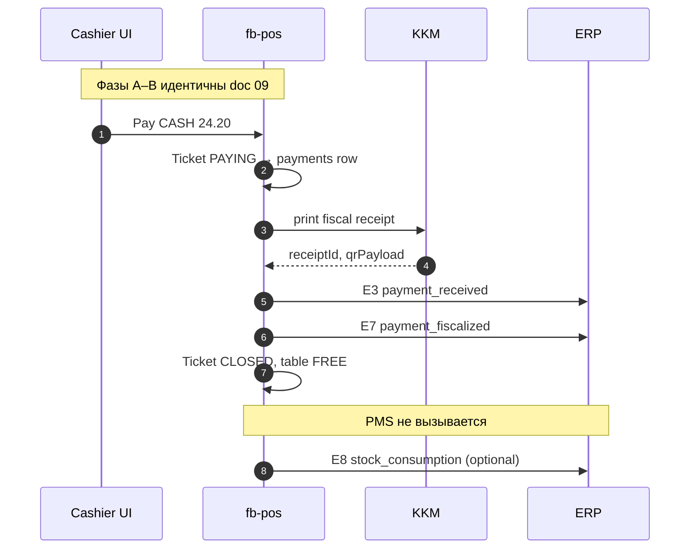
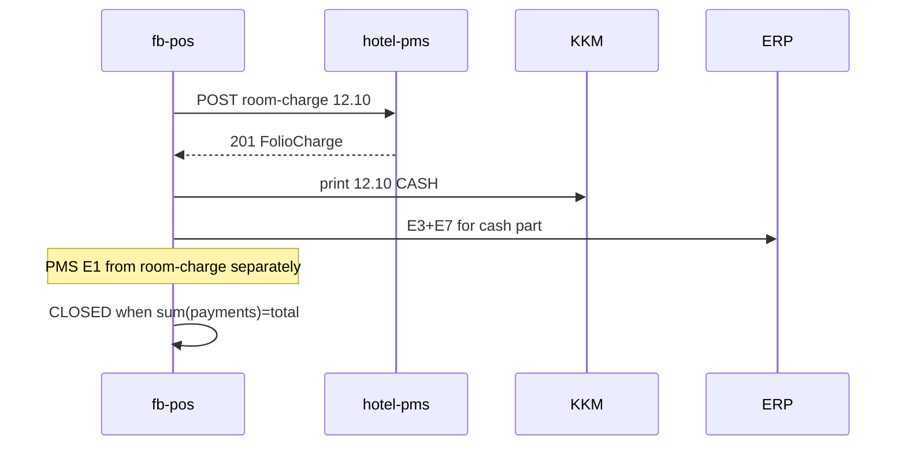

# 10. Wireflow: cash/card на кассе (без PMS)

> Сквозной сценарий закрытия чека **наличными или картой** в `era-fb-pos`.  
> **hotel-pms не вызывается** — folio гостя не меняется.

Связанные документы:

- Room charge (на номер): [09-wireflow-ticket-to-folio.md](09-wireflow-ticket-to-folio.md)
- OpenAPI PMS (только room-charge): [fb-pos-pms-bridge.yaml](../openapi/fb-pos-pms-bridge.yaml)
- AZ / KKM: [17-az-compliance.md](../clone-spec/17-az-compliance.md)
- Outbound E3/E7: [22-outbound-integration-policy.md](../clone-spec/22-outbound-integration-policy.md)

**Участники:**

| ID | Система |
|----|---------|
| W | Терминал официанта / кассира |
| F | era-fb-pos |
| K | KDS |
| KKM | FiscalProvider (NBC/Cybernet или mock) |
| E | ERA Finance |

**Предусловия:** как в [09-wireflow](09-wireflow-ticket-to-folio.md) фазы A–B (смена OPEN, стол, позиции, KDS DONE).  
**Итог к оплате:** **24.20 AZN** (пример).

---

## Обзор (happy path)



---

## Фаза A–B — Заказ и KDS

Повторяют [09-wireflow-ticket-to-folio.md](09-wireflow-ticket-to-folio.md) § A–B:

- `POST /api/tickets` на T-12
- `POST .../lines` (борщ, чай)
- `POST .../fire` → KDS → `DONE`

До экрана оплаты: `Ticket.status = OPEN` или `PRECHECK`.

---

## Фаза C — Экран оплаты (только fb-pos)

| Шаг | Действие |
|-----|----------|
| C1 | Официант: **Оплатить** → `Ticket.status = PAYING` |
| C2 | Способ: **Cash** (или Card) |
| C3 | Сумма = total **24.20** (полная оплата) |
| C4 | Подтверждение |

**Не вызывается:** `GET /api/pms/in-house`, `POST /api/pos/room-charge`.

---

## Фаза D — KKM и локальная фиксация

### D1. Создание payment (fb-pos DB)

```http
POST /api/tickets/a1b2c3d4-e5f6-7890-abcd-ef1234567890/payments HTTP/1.1
Content-Type: application/json

{
  "method": "CASH",
  "amount": 24.20,
  "posShiftId": "shift-uuid-001"
}
```

**Ответ `201`:**

```json
{
  "id": "pay-uuid-111",
  "ticketId": "a1b2c3d4-e5f6-7890-abcd-ef1234567890",
  "method": "CASH",
  "amount": 24.20,
  "status": "PENDING_FISCAL"
}
```

### D2. KKM (реализовано в PMS как mock; в fb-pos — тот же контракт)

```http
POST /api/fiscal/print HTTP/1.1

{
  "paymentId": "pay-uuid-111",
  "amount": 24.20,
  "method": "CASH",
  "outletCode": "RESTAURANT",
  "lines": [
    { "name": "Borsh", "qty": 2, "price": 8.00 },
    { "name": "Tea", "qty": 2, "price": 3.00 }
  ]
}
```

**Ответ KKM `200`:**

```json
{
  "receiptId": "KKM-20260522-00042",
  "qrPayload": "https://monitoring.e-taxes.gov.az/...",
  "fiscalizedAt": "2026-05-22T19:15:00.000Z"
}
```

`payment.status` → `FISCALIZED`.

### D3. Закрытие чека

| Поле | Значение |
|------|----------|
| `Ticket.status` | `CLOSED` |
| `Ticket.paymentMethod` | `CASH` |
| Table T-12 | `FREE` или `DIRTY` |

---

## Фаза E — ERP (E3 + E7)

### E1. E3 `payment_received` (сразу после fiscal OK)

```json
{
  "eventType": "payment_received",
  "source": "era-fb-pos",
  "timestamp": "2026-05-22T19:15:01.000Z",
  "propertyCode": "NAFTA",
  "payload": {
    "ticketId": "a1b2c3d4-e5f6-7890-abcd-ef1234567890",
    "paymentId": "pay-uuid-111",
    "outletCode": "RESTAURANT",
    "amount": 24.20,
    "method": "CASH",
    "revenueCode": "FOOD",
    "posShiftId": "shift-uuid-001"
  }
}
```

> Точное имя `eventType` в ERP — по [18-erp-integration.md](../clone-spec/18-erp-integration.md) / каталогу E3.

### E2. E7 `payment_fiscalized`

```json
{
  "eventType": "SATELLITE_HOTEL_PAYMENT_FISCALIZED",
  "timestamp": "2026-05-22T19:15:01.500Z",
  "payload": {
    "paymentId": "pay-uuid-111",
    "receiptId": "KKM-20260522-00042",
    "qrPayload": "https://monitoring.e-taxes.gov.az/...",
    "amount": 24.20,
    "outletCode": "RESTAURANT"
  }
}
```

В **hotel-pms** аналог уже есть для folio payments (Stage 13 mock). В **fb-pos** — свой `FiscalProvider`, тот же envelope.

### E3. E8 `stock_consumption` (опционально, Nafta → ERP)

После `CLOSED`, асинхронно:

```json
{
  "eventType": "stock_consumption",
  "payload": {
    "ticketId": "a1b2c3d4-e5f6-7890-abcd-ef1234567890",
    "outletCode": "RESTAURANT",
    "lines": [
      { "sku": "ING-BEET-01", "qty": 0.4 },
      { "sku": "ING-TEA-01", "qty": 0.02 }
    ]
  }
}
```

Отказ ERP **не** откатывает оплату (policy в [01-architecture](01-architecture-and-integrations.md)).

---

## Сравнение с room charge

| | Cash/card (этот doc) | Room charge ([09](09-wireflow-ticket-to-folio.md)) |
|--|----------------------|-----------------------------------------------------|
| PMS API | **Нет** | `POST /api/pos/room-charge` |
| Folio гостя | Не меняется | +24.20 FOOD |
| KKM на столе | **Да** | **Нет** |
| E3/E7 | fb-pos → ERP | Только E7 при оплате на ресепшене; charge → E1 chain из PMS |
| Night audit PMS | Не затрагивает folio | Участвует в folio balance |

---

## Card (терминал банка)

| Шаг | Отличие от cash |
|-----|----------------|
| C2 | `method: CARD` |
| D2 | KKM + `terminalRef` от POS-терминала |
| E3 | `method: CARD`, `terminalRef` в payload |

Повторная печать чека — только manager + audit.

---

## Split: cash + room (гибрид)



См. [09-wireflow § Альтернативные ветки](09-wireflow-ticket-to-folio.md#альтернативные-ветки-кратко).

---

## Ошибки

| Ситуация | Поведение |
|----------|-----------|
| KKM timeout | Payment `FISCAL_FAILED`; ticket остаётся `PAYING`; retry или void |
| ERP E3 fail | Локально оплачено; retry queue (Redis) как в PMS outbound |
| Сумма &lt; total | Не закрывать ticket |
| Сумма &gt; total | Сдача (cash) или ошибка (card) |

---

## Чеклист приёмки (FB-03)

- [ ] KKM mock печатает receiptId  
- [ ] Ticket CLOSED, стол FREE  
- [ ] ERP получил E3 + E7 (toggle on)  
- [ ] Folio PMS **без** новой строки  
- [ ] Z-report включает cash 24.20  

---

## Связанные user stories

| ID | История |
|----|---------|
| FB-03 | Гость платит картой — KKM mock, ticket closed |
| FB-08 | Split: половина cash, половина room |
