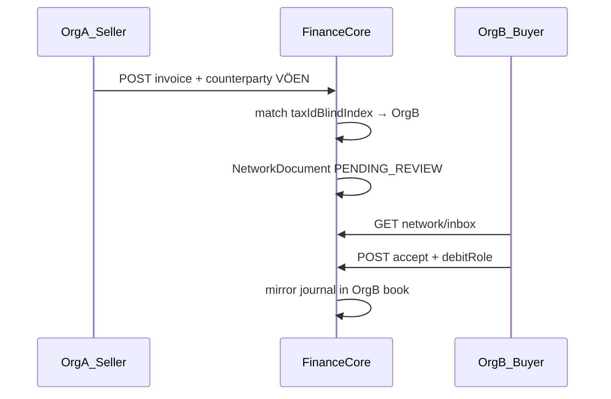

# 3_core — Внутрисетевой обмен документами и зеркальные проводки

**Волна:** `intercompany-network-wave-1`  
**Документы:** [PRD §4.19](../PRD.md) · [TZ §29](../TZ.md)  
**Зависимости:** **`1_core.md`** (все проводки через `PostingRole`, без литералов).  
**Ждёт:** **`4_orchestrator.md`** (e-Qaimə ref, кросс-деплой доставка).  
**Статус:** ✅ выполнено — чек-лист §12 отмечен 2026-06-05; e-Qaimə/cross-deploy → `4_orchestrator.md`.

---

## 0. Архитектура (кратко)



**Запрещено:** одна ACID-транзакция на две org.  
**Разрешено:** outbox + `correlationId` идемпотентность.

---

## 1. Prisma — модель данных

**Файл:** `packages/database/prisma/schema.prisma`

### 1.1 Enum

```prisma
enum NetworkDocumentStatus {
  PENDING_REVIEW
  ACCEPTED
  REJECTED
  POSTED
  SUPERSEDED
}
```

### 1.2 Model

```prisma
model NetworkDocument {
  id                    String                @id @default(dbgenerated("uuid_generate_v4()")) @db.Uuid
  correlationId         String                @map("correlation_id") @db.Uuid
  issuerOrganizationId  String                @map("issuer_organization_id") @db.Uuid
  recipientOrganizationId String              @map("recipient_organization_id") @db.Uuid
  sourceInvoiceId       String                @map("source_invoice_id") @db.Uuid
  status                NetworkDocumentStatus @default(PENDING_REVIEW)
  currency              String                @default("AZN")
  totalNet              Decimal               @map("total_net") @db.Decimal(19, 4)
  vatAmount             Decimal               @default(0) @map("vat_amount") @db.Decimal(19, 4)
  totalGross            Decimal               @map("total_gross") @db.Decimal(19, 4)
  lines                 Json                  @default("[]")
  issuerInvoiceNumber   String?               @map("issuer_invoice_number")
  issuerTaxIdBlindIndex String?               @map("issuer_tax_id_blind_index")
  recipientDebitRole    String?               @map("recipient_debit_role")
  recipientClaimsVat    Boolean               @default(true) @map("recipient_claims_vat")
  recipientTransactionId String?              @map("recipient_transaction_id") @db.Uuid
  rejectReason          String?               @map("reject_reason")
  eQaimeRef             String?               @map("e_qaime_ref")
  createdAt             DateTime              @default(now()) @map("created_at")
  updatedAt             DateTime              @updatedAt @map("updated_at")

  issuerOrganization    Organization @relation("NetworkDocIssuer", fields: [issuerOrganizationId], references: [id])
  recipientOrganization Organization @relation("NetworkDocRecipient", fields: [recipientOrganizationId], references: [id])
  sourceInvoice         Invoice      @relation(fields: [sourceInvoiceId], references: [id])

  @@unique([correlationId, recipientOrganizationId])
  @@index([recipientOrganizationId, status, createdAt(sort: Desc)])
  @@index([issuerOrganizationId, createdAt(sort: Desc)])
  @@map("network_documents")
}
```

**Organization.settings** (JSON) — ключ:

```json
{ "networkDocuments": { "acceptInbound": true } }
```

Миграция: `npx prisma migrate dev --name network_documents`.

---

## 2. FEAT-FC-NET-001 — Матчинг контрагент → тенант

**Создать:** `apps/api/src/network/network-tenant-match.service.ts`

```typescript
@Injectable()
export class NetworkTenantMatchService {
  async findRecipientOrgForCounterparty(
    issuerOrgId: string,
    counterpartyId: string,
  ): Promise<{ recipientOrgId: string } | null> {
    const cp = await this.prisma.counterparty.findFirst({
      where: { id: counterpartyId, organizationId: issuerOrgId },
      select: { taxIdBlindIndex: true },
    });
    if (!cp?.taxIdBlindIndex) return null;
    const recipient = await this.prisma.organization.findFirst({
      where: {
        taxIdBlindIndex: cp.taxIdBlindIndex,
        id: { not: issuerOrgId },
      },
      select: { id: true, settings: true },
    });
    if (!recipient) return null;
    if (!this.acceptsInbound(recipient.settings)) return null;
    return { recipientOrgId: recipient.id };
  }

  private acceptsInbound(settings: unknown): boolean {
    const s = settings as { networkDocuments?: { acceptInbound?: boolean } };
    return s?.networkDocuments?.acceptInbound === true;
  }
}
```

**Opt-in default:** `false` — пока org не включит в настройках.

---

## 3. FEAT-FC-NET-002 — Outbox при создании счёта

**Создать:** `apps/api/src/network/network-document.service.ts`

Методы:

- `scheduleEmitFromInvoice(issuerOrgId, invoiceId)` — fire-and-forget (как `scheduleUpsert`)
- `emitFromInvoice(issuerOrgId, invoiceId)` — идемпотентно:
  1. Load invoice + counterparty + lines
  2. `NetworkTenantMatchService.findRecipientOrgForCounterparty`
  3. `correlationId = invoice.id` (или uuid v5 от invoice.id)
  4. `upsert` NetworkDocument `PENDING_REVIEW` on recipient side

**Хук в** `apps/api/src/invoices/invoices.service.ts` — метод `create` (~342):

После успешного revenue recognition / commit:

```typescript
this.networkDocs.scheduleEmitFromInvoice(organizationId, invoice.id);
```

**Module:** `apps/api/src/network/network.module.ts` — import `InvoicesModule` forwardRef если цикл.

**Не блокировать HTTP** — ошибки логировать WARN.

---

## 4. API — Inbox (получатель B)

**Контроллер:** `apps/api/src/network/network-documents.controller.ts`

| Method | Path | Auth | Описание |
|--------|------|------|----------|
| GET | `/api/network/documents/inbox` | org user | `status=PENDING_REVIEW` для `recipientOrganizationId = active org` |
| GET | `/api/network/documents/inbox/:id` | org user | деталь + lines |
| POST | `/api/network/documents/inbox/:id/accept` | `canPostAccounting` | body: `{ debitRole, claimsVat, postingDate? }` |
| POST | `/api/network/documents/inbox/:id/reject` | org user | body: `{ reason }` |
| PATCH | `/api/organization/settings/network-documents` | admin | `{ acceptInbound: boolean }` |

### 4.1 Accept — зеркальная проводка

**Создать:** `network-document-posting.service.ts`

```typescript
async acceptAndPost(recipientOrgId: string, docId: string, body: AcceptDto) {
  // 1. Load doc PENDING_REVIEW, recipientOrgId match
  // 2. Period lock / HARD_BLOCK / DisputeFreezeGuard — same as manual journal
  // 3. Resolve accounts:
  //    debit = body.debitRole (INVENTORY_GOODS | MISC_OPERATING_EXPENSE | PREPAID_ASSET | ...)
  //    credit = SUPPLIER_PAYABLE
  //    vat debit VAT_INPUT if claimsVat
  // 4. accounting.postJournalInTransaction
  // 5. status POSTED, recipientTransactionId set
}
```

**Схема строк (пример для goods + VAT):**

| Side | Role | Amount key |
|------|------|------------|
| Dr | `recipientDebitRole` | totalNet |
| Dr | `VAT_INPUT` (if claimsVat) | vatAmount |
| Cr | `SUPPLIER_PAYABLE` | totalGross |

Использовать `PostingAccountResolver.resolveMany`.

**Валидация debitRole:** whitelist `INVENTORY_GOODS`, `MISC_OPERATING_EXPENSE`, `PREPAID_ASSET`, fixed-asset role if added later.

---

## 5. Frontend — Inbox UI

**Создать страницу:** `apps/web/app/finance/network-inbox/page.tsx`

- `PageHeader` + badge count pending
- `DATA_TABLE_*`: issuer name, invoice #, date, gross, status, actions
- Row «Qəbul et» → `AcceptNetworkDocumentModal`:
  - Select debit role (az labels)
  - Checkbox ƏDV-k-зачёту
  - Date picker (period)
- «Rədd et» → reason

**Навигация:** добавить пункт в sidebar (`app-shell` nav config) под Finance.

**i18n:** ключи `networkInbox.*` в `packages/i18n`.

---

## 6. FEAT-FC-NET-006 — Автонеттинг (Фаза 2 внутри 3_core)

**Расширить** `apps/api/src/accounting/netting.service.ts` или новый `network-netting.service.ts`:

- Input: `orgAId`, `orgBId` (оба ERA residents)
- Найти встречные AR/AP по паре контрагентов-зеркал
- `POSTING_SCHEMAS.NETTING` через `PostingJournalBuilder`
- UI: кнопка на странице сверки контрагентов «Взаимозачёт (ERA network)»

**Условие:** оба документа `POSTED` или подтверждённые остатки.

---

## 7. Фаза 2 — Straight-through (опционально, feature flag)

**Organization.settings:**

```json
{ "networkDocuments": { "acceptInbound": true, "autoPostSafeRoles": ["MISC_OPERATING_EXPENSE"] } }
```

При emit: если `autoPostSafeRoles` contains default role → сразу `acceptAndPost` без UI.

**Assets/inventory roles** — never auto (D-NET-1).

---

## 8. Сторно / supersede

При отмене/корректировке invoice у A:

- `network-document.service.markSuperseded(correlationId)` → status `SUPERSEDED` у B
- Новый invoice → новый correlationId или новая версия (document version field optional)

---

## 9. Безопасность

- `DisputeFreezeGuard` на accept/reject POST
- Audit log: `NETWORK_DOCUMENT_ACCEPT`, `NETWORK_DOCUMENT_REJECT`
- RLS: recipient видит только `recipientOrganizationId = ctx.orgId`
- Issuer видит исходящие: `GET /api/network/documents/outbox` (optional)

---

## 10. Тесты

**Создать:** `apps/api/test/network/network-document.spec.ts`

Сценарии:

1. Match: org B same VÖEN as counterparty → document created
2. No match: external VÖEN → no document
3. Accept: journal balanced, status POSTED
4. Reject: no journal
5. Idempotent emit: два вызова → один document
6. Opt-in false → no document

**Seed:** два org с известными `taxIdBlindIndex` в demo seed.

---

## 11. Команды

```powershell
cd era-finance-core/packages/database
npx prisma migrate dev --name network_documents
cd ../..
npm run build -w @erafinance/api
npm test -w @erafinance/api -- network-document
```

---

## 12. Чек-лист приёмки

- [x] Prisma `NetworkDocument` + migration
- [x] Match service + opt-in settings
- [x] Emit hook on invoice create (async)
- [x] Inbox API accept/reject with mirror posting via roles
- [x] UI inbox page + modals
- [x] Period lock / HARD_BLOCK respected on accept
- [x] Idempotent correlationId
- [x] Нет литералов NAS в posting path
- [x] e-Qaimə / cross-deploy **не** реализованы здесь → `4_orchestrator.md` *(вынесено и выполнено в `4_orchestrator.md`)*

---

## 13. Заглушки для 4_orchestrator

- Поле `eQaimeRef` оставить NULL
- Интерфейс `NetworkDocumentTransport` (interface only):

```typescript
export interface NetworkDocumentTransport {
  deliver(doc: NetworkDocumentPayload): Promise<void>;
}
// InProcessTransport — default (same DB)
// OrchestratorTransport — stub throws NotImplemented
```

Реализация OrchestratorTransport в `4_orchestrator.md`.
