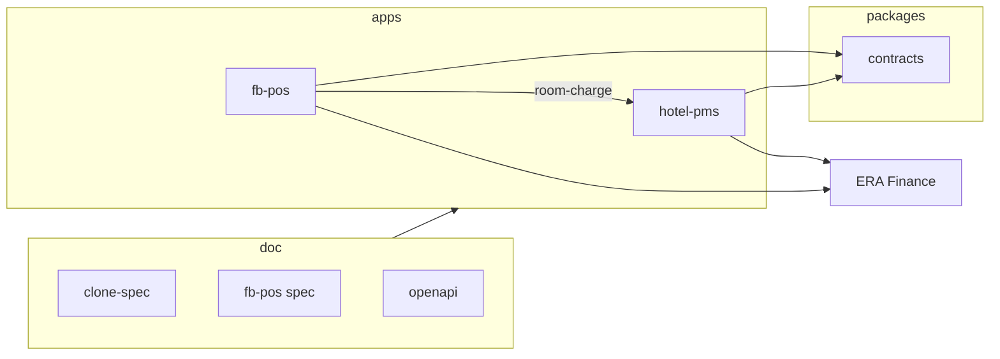

# ERA Umbrella Monorepo — план объединения

> **Цель:** один репозиторий для `era-hotel-pms`, `era-fb-pos`, общих контрактов и документации — без потери ссылок и истории спеки.  
> **Статус:** планирование (текущий код живёт в `era-hotel-pms` как single-repo).

См. полный реестр файлов: [DOCUMENTATION-INDEX.md](DOCUMENTATION-INDEX.md).

---

## 1. Целевая структура

```text
era-hospitality/                    # umbrella (рабочее имя; зафиксировать при создании repo)
├── package.json                    # npm/pnpm workspaces
├── pnpm-workspace.yaml
├── turbo.json                      # optional
├── docker-compose.yml              # profiles: infra, pms, fb-pos, all
├── apps/
│   ├── hotel-pms/                  # ← текущий era-hotel-pms (код)
│   │   ├── app/
│   │   ├── prisma/
│   │   ├── src/
│   │   ├── package.json            # name: @era/hotel-pms
│   │   └── README.md               # → doc/ ниже
│   └── fb-pos/                     # ← будущий era-fb-pos
│       ├── app/
│       ├── prisma/
│       ├── package.json            # name: @era/fb-pos
│       └── README.md
├── packages/
│   └── contracts/                  # OpenAPI, shared Zod types (optional)
│       ├── openapi/
│       │   ├── fb-pos-pms-bridge.yaml
│       │   ├── erp-inbound-e6.yaml
│       │   └── erp-outbound-catalog.yaml
│       └── package.json            # name: @era/contracts
├── doc/                            # ЕДИНЫЙ корень документации (не дублировать в apps)
│   ├── README.md
│   ├── DOCUMENTATION-INDEX.md
│   ├── MONOREPO.md                 # этот файл
│   ├── DELIVERY.md                 # индекс + hotel-pms tracker
│   ├── clone-spec/
│   ├── fb-pos/
│   ├── nafta/
│   ├── openapi/                    # symlink или copy → packages/contracts/openapi
│   ├── reference/
│   ├── screens/
│   └── UAT-SMOKE.md
├── scripts/                        # nafta manifest, trace (общие)
└── .github/workflows/
    ├── ci-pms.yml
    └── ci-fb-pos.yml
```

**Принцип:** продуктовая спека и Nafta-артефакты — **только** в корневом `doc/`. В `apps/*` — README с ссылкой `../../doc/...`.

---

## 2. Что переносится из текущего `era-hotel-pms`

| Сейчас (корень repo) | После monorepo |
|----------------------|----------------|
| `app/`, `src/`, `prisma/` | `apps/hotel-pms/` |
| `package.json`, `next.config.*` | `apps/hotel-pms/` |
| `Dockerfile` | `apps/hotel-pms/Dockerfile` или root multi-target |
| `doc/` | **остаётся** `doc/` на корне umbrella |
| `scripts/` | корень или `tools/scripts/` |
| `docker-compose.yml` | корень + profiles |
| `.env.example` | `apps/hotel-pms/.env.example` + root `.env.example` для compose |

**Не переносить в fb-pos:** `/admin/stock` (Nafta → ERP), медконтур, night audit.

---

## 3. Документация — правила без потерь

### 3.1 Канонические пути (не менять якоря)

| Путь | Назначение |
|------|------------|
| `doc/clone-spec/*.md` | ТЗ hotel-pms |
| `doc/fb-pos/*.md` | ТЗ era-fb-pos |
| `doc/clone-spec/23-pos-bridge.md` | Серверный контракт room-charge |
| `doc/openapi/fb-pos-pms-bridge.yaml` | OpenAPI моста |
| `doc/fb-pos/09-wireflow-*.md` | Сквозные сценарии |
| `doc/nafta/*` | Nafta screens, license |

### 3.2 Относительные ссылки

Ссылки вида `../clone-spec/23-pos-bridge.md` из `doc/fb-pos/` **остаются валидными** при переносе кода в `apps/` — меняется только расположение `app/`, не `doc/`.

### 3.3 Что обновить при миграции

| Место | Действие |
|-------|----------|
| `doc/DELIVERY.md` | Пути к `apps/hotel-pms` в Verify-блоках |
| `doc/fb-pos/08-extraction-to-satellite-repo.md` | Путь B: monorepo (основной) |
| CI badges / README корня | Workspace install |
| `doc/README.md` | Структура monorepo |
| Внешние закладки на GitHub `era-hotel-pms/doc/` | Redirect note в root README |

### 3.4 Дублирование OpenAPI

**Один источник правды:**

- Канон: `packages/contracts/openapi/`
- `doc/openapi/*.yaml` — копия или symlink для читателей спеки (документировать в INDEX)

---

## 4. Связи приложений в monorepo



| Интеграция | Env (пример) |
|------------|----------------|
| fb-pos → PMS | `PMS_BRIDGE_URL=http://hotel-pms:3000` |
| Shared secret | `POS_BRIDGE_SECRET` (один в compose) |
| ERP outbound | каждый app свой `ERP_WEBHOOK_URL` |

---

## 5. Docker Compose (целевой)

```yaml
# фрагмент — иллюстрация
services:
  postgres-pms:
    ...
  postgres-fbpos:
    ...
  hotel-pms:
    profiles: [pms, all]
    build: ./apps/hotel-pms
  fb-pos:
    profiles: [fb-pos, all]
    build: ./apps/fb-pos
    environment:
      PMS_BRIDGE_URL: http://hotel-pms:3000
```

Profile `all` — интеграционные тесты room-charge E2E.

---

## 6. Workspaces (npm/pnpm)

```json
{
  "name": "era-hospitality",
  "private": true,
  "workspaces": ["apps/*", "packages/*"]
}
```

| Пакет | name |
|-------|------|
| PMS | `@era/hotel-pms` |
| F&B POS | `@era/fb-pos` |
| Contracts | `@era/contracts` |

---

## 7. Чеклист миграции (порядок)

### Фаза M0 — Подготовка (без перемещения кода)

- [x] Спека fb-pos в `doc/fb-pos/`
- [x] OpenAPI + wireflows 09/10
- [x] [DOCUMENTATION-INDEX.md](DOCUMENTATION-INDEX.md)
- [x] Этот [MONOREPO.md](MONOREPO.md)
- [ ] Зафиксировать имя umbrella repo (`era-hospitality` vs `era-sanatorium`)

### Фаза M1 — Создать umbrella

- [ ] `git init` / перенос history (`git filter-repo` или subtree)
- [ ] Переместить код → `apps/hotel-pms/`
- [ ] Корневой `package.json` workspaces
- [ ] `docker compose` profiles
- [ ] CI: build `@era/hotel-pms` (green)

### Фаза M2 — Contracts package

- [ ] `packages/contracts/openapi/` из `doc/openapi/`
- [ ] Скрипт `npm run contracts:lint` (redocly)
- [ ] Опционально: codegen types для bridge

### Фаза M3 — fb-pos scaffold

- [ ] `apps/fb-pos/` по [DELIVERY-FB.md](fb-pos/DELIVERY-FB.md) FB-0
- [ ] Profile `fb-pos` в compose
- [ ] E2E: [09-wireflow](fb-pos/09-wireflow-ticket-to-folio.md)

### Фаза M4 — Закрытие старого repo

- [ ] Archive `era-hotel-pms` → redirect README → monorepo
- [ ] Обновить clone URLs в Cursor / CI
- [ ] Bump `DOCUMENTATION-INDEX` version

---

## 8. Отдельный repo `era-fb-pos` — когда не нужен

При umbrella **отдельный репозиторий fb-pos не создаём**. Вместо [08-extraction](fb-pos/08-extraction-to-satellite-repo.md) §1 — папка `apps/fb-pos`.

Отдельный repo имеет смысл только если:

- другая команда / другой релизный цикл без доступа к PMS;
- white-label F&B без отеля.

Для Nafta — **monorepo**.

---

## 9. DELIVERY в umbrella

| Файл | Содержание |
|------|------------|
| [DELIVERY.md](DELIVERY.md) | hotel-pms + Stage 17 bridge + ссылка на FB |
| [fb-pos/DELIVERY-FB.md](fb-pos/DELIVERY-FB.md) | Только fb-pos |
| (optional) `DELIVERY-UMBRELLA.md` | Сводный gate go-live обоих apps |

---

## 10. Риски и митигация

| Риск | Митигация |
|------|-----------|
| Битые ссылки после move | `DOCUMENTATION-INDEX` + grep `](../` перед merge |
| Два DELIVERY расходятся | Stage 17 в PMS блокирует FB-07 |
| OpenAPI drift | Один `packages/contracts` |
| Документация не в CI | Job `docs:links` (markdown-link-check) |
| Путаница stock MVP | Явно в INDEX: dev-only, Nafta → ERP |

---

## Связанные документы

- [DOCUMENTATION-INDEX.md](DOCUMENTATION-INDEX.md) — реестр всех файлов
- [fb-pos/08-extraction-to-satellite-repo.md](fb-pos/08-extraction-to-satellite-repo.md) — обновлён под monorepo
- [DELIVERY.md](DELIVERY.md) Stage 17
