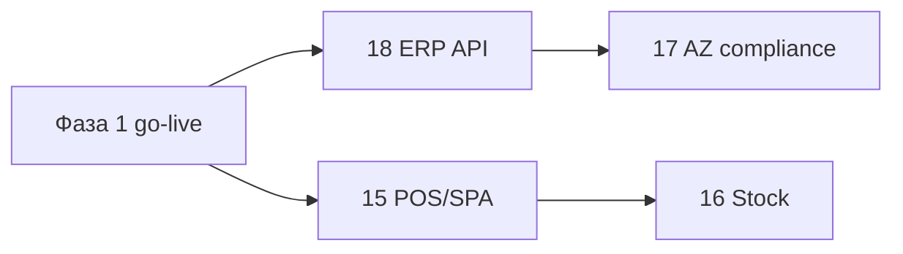

# 14. Фаза 2 — дорожная карта

> После go-live фазы 1 ([03-phase1-modules.md](03-phase1-modules.md))  
> Валидация scope: [13-nafta-validation-checklist.md](13-nafta-validation-checklist.md)

## Цель фазы 2

Закрыть **операционные** модули, которые Nafta платит в Elektraweb, но почти не использует на скринах; плюс **AZ compliance** и **двусторонняя ERP** — без превращения PMS в GL.

## Принцип (без изменений)

```
Фаза 1: отель работает (бронь → folio → night audit)
Фаза 2: ресторан/склад/фискал + ERP sync + мобильность
```

GL, NAS, e-qaimə submission — по-прежнему **ERP / fiscal gateway**, PMS даёт события и статусы.

---

## Пакеты работ

| Пакет | Документ | Зависит от | Приоритет Nafta |
|-------|----------|------------|-----------------|
| **P2-A** ERP интеграция (тех.) | [18-erp-integration.md](18-erp-integration.md) | Фаза 1 E1–E5 | 🔴 после ответов чеклиста §C |
| **P2-B** AZ fiscal & tourism | [17-az-compliance.md](17-az-compliance.md) | ERP или шлюз | 🔴 для перепродажи в AZ |
| **P2-C** POS / F&B / SPA-касса | [15-pos-fb-spa.md](15-pos-fb-spa.md) · [era-fb-pos](../../era-fb-pos/doc/README.md) | Фаза 1 quick posting | 🟡 **era-fb-pos** сателлит; SPA-касса — **не** отдельный (§H чеклиста 13) |
| **P2-D** Склад и закупки | [16-stock-procurement.md](16-stock-procurement.md) | POS (списание) | 🟡 / 🟢 |
| **P2-E** Доп. продукт | — | — | 🟢 |

### P2-E (коротко, без отдельного ТЗ пока)

| Функция | Условие |
|---------|---------|
| HK mobile | После HK-02 |
| Booking engine B2C | Если нет внешнего сайта |
| Door locks | Если есть железо + маппинг |
| DMENU QR-меню | Если нужен гостевой заказ |
| Auto email reports | WA0345–0346 |
| WhatsApp CRM | WA0159+ |

---

## Что уже есть в фазе 1 (не дублировать)

| Функция Elektraweb | Наш аналог ф.1 |
|--------------------|----------------|
| Quick posting WA0135 | [05-folio-and-cash.md](05-folio-and-cash.md) §5.3 |
| POS-календарь WA0146 | Частично CRM; полный POS — ф.2 |
| Мед. на folio | [06-channel-crm-med.md](06-channel-crm-med.md) §C.5 |
| Маппинг услуг WA0282 | 09 + 06 |

---

## Рекомендуемый порядок внедрения



1. **18** — без API нет e-qaimə-цепочки и статусов счетов.  
2. **17** — параллельно с ERP, если выбран интегратор KKM.  
3. **15** — если ресторан/SPA-касса подтверждены (чеклист A1–A2).  
4. **16** — после POS или если склад ведут в Excel и хотят в PMS.

---

## Лицензия Elektraweb vs наш продукт

| Модуль TR | EUR/год ~ | Фаза 2 у нас |
|-----------|-----------|--------------|
| POS | в пакете | 15 |
| F&B | 307 | 15 (рецептуры) |
| SPA | 475 | 15 (касса) или CRM-only |
| STOCK | в пакете | 16 |
| Procurement | 214 | 16 |
| FixedAsset | 154 | ERP, не PMS |
| DoorLock | 214 | P2-E |
| DMENU | 37 | P2-E |

См. [../nafta/license-optimization.md](../nafta/license-optimization.md).

---

## Критерии готовности фазы 2

| # | Критерий |
|---|----------|
| G2-1 | E1–E5 доставляются в ERP с retry и журналом ошибок |
| G2-2 | Счёт гостя может получить статус fiscal «отправлен / отклонён» (read-only) |
| G2-3 | POS-чек закрывается с опцией «на номер» → charge на folio |
| G2-4 | (Опционально) продажа блюда списывает склад по рецепту |
| G2-5 | Tourism registry: заезд/выезд уходит в гос. API или ERP-прокси |

---

## Статус

| Пакет | Спека | Разработка |
|-------|-------|------------|
| P2-A | ✅ 18 | 🔄 Stage 12 — fiscal E6, E1+payments |
| P2-B | ✅ 17 | ⏸ |
| P2-C | ✅ 15 | ⏸ |
| P2-D | ✅ 16 | ⏸ |
