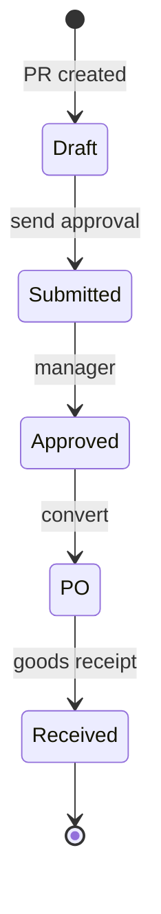

# 16. Склад, закупки, ОС (фаза 2)

> Supplement: [../nafta/supplement-stock-procurement.md](../nafta/supplement-stock-procurement.md)

## 16.0 Обзор

| Модуль | В PMS ф.2? | Комментарий |
|--------|------------|-------------|
| Номенклатура (SKU) | ✅ | WA0284–0285 |
| Рецептуры | ✅ | WA0283, WA0291 |
| Движения склада | ✅ | приход / расход / перемещение |
| Закупки (PR → PO) | ✅ опционально | Procurement в лицензии TR |
| Штрихкоды | ✅ | WA0290 |
| Закрытие остатков | ✅ | WA0287 |
| **Основные средства** | ❌ ERP | WA0288–0289 — не клонировать в PMS |
| DMENU | ❌ P2-E | Отдельно |

**Граница:** склад **операционный** (остатки для POS/списания); **бух. учёт запасов** — ERP/NAS.

---

## 16.1 Сущности

| Сущность | Описание |
|----------|----------|
| Warehouse | Главный, бар, кухня, мед. склад |
| Product (SKU) | Ед. изм., группа, штрихкод |
| Stock balance | Остаток по складу |
| Stock movement | Приход / расход / transfer |
| Purchase request (PR) | Заявка от отдела |
| Purchase order (PO) | Заказ поставщику |
| Supplier | Контрагент закупок |
| Recipe link | SKU блюда → ingredients |

---

## 16.2 Справочники (master data)

### Продукты WA0284

| Поле | Обязательно |
|------|-------------|
| Код | ✅ |
| Наименование | ✅ |
| Группа | ✅ |
| Ед. изм. | ✅ |
| Закупочная / продажная цена | Опционально |
| Штрихкод | Для сканера |
| Активен | ✅ |

### Группы WA0285, WA0293

Маппинг группы → **счёт затрат ERP** (не проводка в PMS, только код для E9).

### Настройки WA0321

| Флаг | Поведение |
|------|-----------|
| Запрет отрицательного остатка | Блок продажи POS при нехватке |
| PR на этапе предложения | Workflow закупок |
| Утверждение только менеджером закупок | Роли |
| Подтверждение основного склада | Двухэтапный приход |

---

## 16.3 Операции склада

### 16.3.1 Приход (Goods Receipt)

| Шаг | Действие |
|-----|----------|
| 1 | Создать приход (PO или вручную) |
| 2 | Строки: SKU, qty, цена |
| 3 | Проведение → +остаток |
| 4 | Событие **E9** в ERP (опционально) |

### 16.3.2 Расход / списание

| Источник | Триггер |
|----------|---------|
| POS продажа | Recipe explosion |
| Порча / брак | Ручной документ |
| Мед. расходник | SPA/med модуль |
| Инвентаризация | Корректировка |

### 16.3.3 Перемещение

Между складами (кухня ← главный). Без изменения общего количества по отелю.

### 16.3.4 Инвентаризация

| Поле | Описание |
|------|----------|
| Дата | |
| Склад | |
| Строки | SKU, факт, учёт, delta |

**Проведение:** корректирующие движения; отчёт для ERP.

### 16.3.5 Закрытие периода WA0287

Перенос ending balance — **согласовать с ERP**: дублировать или только выгрузка E9.

---

## 16.4 Закупки (Procurement)

*Если модуль включён после валидации A3.*

| Документ | Роли |
|----------|------|
| PR | Шеф, кладовщик, мед. закупки |
| PO | Менеджер закупок |
| Approval | Настраиваемая цепочка WA0321 |

**Не в PMS:** оплата поставщику, проводки кредиторки — ERP.

---

## 16.5 Связь POS ↔ склад

| Событие | Действие склада |
|---------|-----------------|
| POS line closed (food) | Списание по recipe |
| Void line | Возврат на склад (опция) |
| Нет рецепта | Warning + ручное списание |

---

## 16.6 События для ERP (дополнение к 08/18)

| ID | Когда | Содержание |
|----|-------|------------|
| E8 | Списание по POS | SKU, qty, склад, себестоимость оценочная |
| E9 | Проведён приход | Поставщик, строки, сумма |
| E10 | Инвентаризация | Delta по SKU |

---

## 16.7 User stories

| ID | История |
|----|---------|
| STK-01 | Кладовщик принимает поставку пива на склад бара |
| STK-02 | POS продал 10 порций супа → списаны ингредиенты |
| STK-03 | Инвентаризация: расхождение −2 бутылки → акт |
| STK-04 | Шеф создаёт PR на мясо → менеджер → PO |
| STK-05 | Блок продажи при нулевом остатке (флаг WA0321) |

---

## 16.8 Референс экранов

WA0092, WA0283–0291, WA0293, WA0321.  
**Нужны скрины:** приход, расход, PR/PO workflow, инвентаризация.
