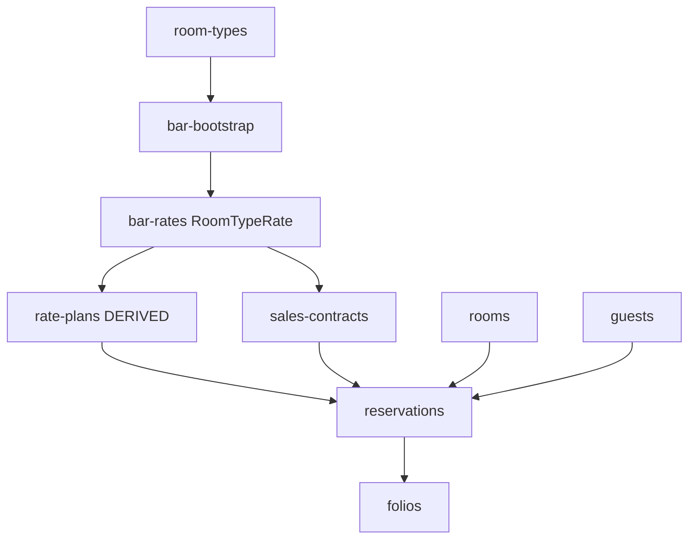

# Nafta bootstrap — import mapping & adapter checklist

**Audience:** platform super-admin running `/admin/import`, developers extending adapters.  
**Context:** empty DB (greenfield) — **no** `ContractPricingRule`, **no** `ERA_PRICING_LEGACY_FALLBACK`, **no** flat `pricePerNight` as source of truth.  
**Pricing SoT:** [hotel-dynamic-rate-plans ADR](../../../docs/adr/hotel-dynamic-rate-plans.md) · [09-master-data §9.3](../clone-spec/09-master-data.md)

Related: [ELEKTRAWEB-IMPORT.md](../ELEKTRAWEB-IMPORT.md) (wizard mechanics) · [B2B-GATE.md](./B2B-GATE.md) · [NAFTA-GUEST-INTELLIGENCE runbook](../NAFTA-GUEST-INTELLIGENCE.md)

---

## 1. Principles (Nafta greenfield)

| Rule | Action |
|------|--------|
| Absolute room price | Only `RoomTypeRate` on `RatePlan` `BAR` (`type=BASE`) |
| OTA / agency / corporate | `RatePlan` `type=DERIVED` + `derivedFromId=BAR` + `adjustmentMode` / `adjustmentValue` |
| B2B seasons & allotments | `SalesContract` + `ContractAllotment` — **not** legacy contract-pricing |
| Historical reservations | Import with correct `ratePlanId`; then **recalc** daily rates from BAR engine |
| Meal plans | Target: `AddOn` + `RatePlanAddOn`; `MealPlan` on reservation OK for display during transition |
| Do not import | Chart of Accounts (finance-core), users/passwords, `ContractPricingRule` |

Env for cutover: **`ERA_PRICING_LEGACY_FALLBACK` unset or `false`**.

---

## 2. Extended import pipeline

Wizard phases are extended with **pricing steps** between master data and transactional load.

```text
Phase 0 — Platform
  prisma migrate deploy
  npm run db:seed:reference          # universal RevenueCode, BedType, RoomView

Phase 1 — Dictionaries (wizard, any order)
  revenue-codes · bed-types · room-views

Phase 2 — Master inventory (strict order)
  room-types
  bar-bootstrap                      # NEW: ensure BAR RatePlan exists (script or adapter)
  bar-rates                          # NEW: RoomTypeRate calendar
  rate-plans                         # UPDATE: DERIVED linked to BAR
  meal-add-ons                       # NEW optional: AddOn + RatePlanAddOn from MealPlan export
  sales-contracts                    # NEW: SalesContract + ContractAllotment
  rooms
  agencies
  product-cards · stock-cards

Phase 3 — Transactional (strict order)
  guests
  reservations                       # UPDATE: ratePlanCode, salesContractCode, recalc hook
  folios

Phase 4 — Post-import batch (scripts, not wizard)
  recalc-all-reservations
  backfill-global-person-id
  spot-check quoteStay vs Elektra sample
```



---

## 3. Elektraweb file → ERA entity (full map)

| # | Elektraweb export (template) | Wizard slug | Prisma | Upsert key | Adapter status |
|---|------------------------------|-------------|--------|------------|----------------|
| 10 | Revenue Code Definitions.xlsx | `revenue-codes` | `RevenueCode` | `code` | ✅ Done |
| 11 | Bed Type.xlsx | `bed-types` | `BedType` | `code` | ✅ Done |
| 12 | Room Views.xlsx | `room-views` | `RoomView` | `code` | ✅ Done |
| 20 | Room Types.xlsx | `room-types` | `RoomType` | `code` | ✅ Done |
| 21a | *(script)* BAR bootstrap | `bar-bootstrap` | `RatePlan` BAR | `code=BAR` | Done |
| 21b | BAR / yield calendar * | `bar-rates` | `RoomTypeRate` | `(ratePlanId, roomTypeId, date)` | 🔲 New |
| 21 | Rate Codes.xlsx | `rate-plans` | `RatePlan` | `code` | ⚠️ Update |
| 21c | Meal plan / board codes * | `meal-add-ons` | `AddOn`, `RatePlanAddOn` | `code` | 🔲 New optional |
| 22 | Contract Details / Discounts * | `sales-contracts` | `SalesContract`, `ContractAllotment` | `code` | 🔲 New |
| 22 | Rooms.xlsx | `rooms` | `Room` | `roomNumber` | ✅ Done |
| 30 | Travel Agencies.xlsx | `agencies` | `Agency` | `code` | ✅ Done |
| 31–32 | Product / Stock Cards | `product-cards`, `stock-cards` | `Product` | `code` | ✅ Done |
| 40 | Guests.xlsx | `guests` | `Guest` | `externalRef` | ✅ Done |
| 50 | Reservations.xlsx | `reservations` | `Reservation` | `externalRef` | ⚠️ Update |
| 60 | Folios.xlsx | `folios` | `FolioCharge` | `externalRef` | ✅ Done |

\* Files marked with asterisk are **not** in the standard 13-template wizard list today — Nafta must provide exports from ElektraWeb screens (yield calendar, Contract Details, Contract Discounts & Supplements). See §8 audit.

**Nafta manifest reference:** `_Contract Discounts & Supplements…xlsx` ([screens-manifest-v2-wave5-must.json](./screens-manifest-v2-wave5-must.json)).

---

## 4. Pricing layer mapping (detail)

### 4.1 BAR bootstrap (`bar-bootstrap`)

**Purpose:** Create exactly one BASE plan before any calendar or DERIVED rows.

| ERA field | Value |
|-----------|-------|
| `RatePlan.code` | `BAR` |
| `RatePlan.type` | `BASE` |
| `RatePlan.pricePerNight` | `0` (ignored at runtime) |
| `RatePlan.active` | `true` |

**Implementation options:** one-row adapter or `POST` hook in wizard step 21a; alternative: extend `rate-plans` adapter to upsert BAR first.

---

### 4.2 BAR calendar (`bar-rates`) — **source of room revenue**

ElektraWeb does not ship `RoomTypeRate` in the standard 13 files. Map from **one or more** Nafta sources (confirm on site):

| Source (priority) | Typical Elektra screen | ERA output |
|-------------------|------------------------|------------|
| **A** Yield / BAR grid export | Rate management, season grid | 1 row → `(roomTypeCode, date, amountAZN)` |
| **B** Contract Details season prices | Contract Details | Same, if grid is per room type × date |
| **C** Flat fallback per room type | Rate Codes + manual Nafta spreadsheet | 1 price × date range × room type (bootstrap only) |

**Row → `RoomTypeRate`:**

| Excel / export column (expected) | ERA field | Transform |
|----------------------------------|-----------|-----------|
| Room Type / Room Type Code | `roomTypeId` | resolve `RoomType.code` |
| Date / Stay Date | `date` | UTC date only |
| Amount / Price / BAR | `amount` | `Decimal(12,2)` AZN |
| Currency | `currencyCode` | default `AZN` |
| *(implicit)* | `ratePlanId` | always BAR plan id |

**Validation:** every night in Nafta go-live window × every active `RoomType` must have a row; otherwise `quoteStay` throws `RATE_NOT_LOADED`.

---

### 4.3 Rate codes → DERIVED (`rate-plans` adapter update)

Current adapter creates `DERIVED` without `derivedFromId`. **Target behavior:**

| Elektra `Rate Codes.xlsx` column | ERA field | Rule |
|----------------------------------|-----------|------|
| Rate Code | `RatePlan.code` | uppercase, unique |
| Rate Code Group / Name | `RatePlan.name` | |
| *(if code = BAR)* | `type=BASE` | skip or merge into bar-bootstrap |
| All other codes | `type=DERIVED` | |
| | `derivedFromId` | BAR.id |
| Discount % / Markup % * | `adjustmentMode=PERCENT`, `adjustmentValue` | discount → negative (e.g. −10) |
| Fixed supplement * | `adjustmentMode=FIXED`, `adjustmentValue` | +N AZN |
| Medical / sanatorium flag * | `medicalFlag=true` | keep package lines separate from BAR |
| Non-refundable * | `isRefundable=false` | |

\* Column names **TBD** after Nafta file audit — map in adapter `headerAliases`.

**Do not set** meaningful `pricePerNight` on DERIVED rows (store `0`).

---

### 4.4 B2B contracts (`sales-contracts`) — **new adapter**

Map Elektra **Contract Details** + **Contract Discounts & Supplements** → P4 models ([B2B-GATE](./B2B-GATE.md)).

| Elektra concept | ERA model | Fields |
|-----------------|-----------|--------|
| Contract code / name | `SalesContract` | `code`, `name` |
| Agency | `SalesContract.agencyId` | resolve `Agency.code` |
| Valid from / to | `validFrom`, `validTo` | |
| Linked rate code | `ratePlanId` | DERIVED plan from §4.3 |
| Commission % | `commissionPercent` | optional override |
| Deposit | `depositRequired`, `depositAmount` | |
| Room type + quota + season | `ContractAllotment` | `roomTypeId`, `validFrom`, `validTo`, `nightlyQuota`, `releaseDays` |
| Status | `SalesContract.status` | import as `ACTIVE` if valid today |

**Reservation link (Phase 3):** if Reservations export has contract/agency columns → set `salesContractId` + matching `ratePlanId`.

---

### 4.5 Meal / board (optional `meal-add-ons`)

| Elektra meal code | ERA |
|-------------------|-----|
| BB, HB, FB, RO | `AddOn.code` + `revenueCode=FOOD` |
| Price per guest-night | `AddOn.price`, `pricingUnit=PER_GUEST_NIGHT` |
| Included on rate plan | `RatePlanAddOn.inclusion=INCLUDED` |
| Optional upgrade | `INCLUDED` vs `OPTIONAL` |

Keep `Reservation.mealPlanId` if present in Reservations export for FO display.

---

### 4.6 Reservations (updates)

| Elektra `Reservations.xlsx` column | ERA field | Current | Target |
|------------------------------------|-----------|---------|--------|
| Res Id | `externalRef` | ✅ | ✅ |
| Guest Name | `guestId` | ✅ | ✅ |
| Room Type | `roomTypeId` | ✅ | ✅ |
| Room No | `roomId` | ✅ | ✅ |
| Agency | `agencyId` | ✅ | ✅ |
| Rate Code * | `ratePlanId` | ❌ first active plan | resolve by `RatePlan.code` |
| Contract / Voucher * | `salesContractId`, `contractRef` | ❌ | resolve `SalesContract.code` |
| Arrival / Departure | dates | ✅ | ✅ |
| State | `status` | ✅ | ✅ |

After upsert: call `recalcReservationDailyRates(id)` so `ReservationDailyRate` + `totalAmount` come from `quoteStay`, not import snapshot.

---

## 5. Adapter checklist (implementation tracker)

| Slug | File | Status | Work required |
|------|------|--------|---------------|
| `revenue-codes` | `revenue-codes.adapter.ts` | ✅ | None for Nafta |
| `bed-types` | `bed-types.adapter.ts` | ✅ | None |
| `room-views` | `room-views.adapter.ts` | ✅ | None |
| `room-types` | `room-types.adapter.ts` | ✅ | Verify Nafta column names in preview |
| `bar-bootstrap` | *(new)* | Done | Create BAR BASE plan; `adapters/index.ts`, `phases.ts` order **20.5**, fileless wizard step |
| `bar-rates` | *(new)* | 🔲 | Parse yield/season grid → `RoomTypeRate`; bulk upsert |
| `rate-plans` | `rate-plans.adapter.ts` | ⚠️ | Link DERIVED→BAR; map %/fixed; skip duplicate BAR |
| `meal-add-ons` | *(new, optional)* | 🔲 | MealPlan export → AddOn graph |
| `sales-contracts` | *(new)* | 🔲 | SalesContract + ContractAllotment rows |
| `rooms` | `rooms.adapter.ts` | ✅ | None |
| `agencies` | `agencies.adapter.ts` | ✅ | Map `commissionPercent` if column exists |
| `product-cards` / `stock-cards` | `products.adapter.ts` | ✅ | None |
| `guests` | `guests.adapter.ts` | ✅ | Run MDM backfill after (Phase 4) |
| `reservations` | `reservations.adapter.ts` | ⚠️ | `ratePlanCode`, `salesContractCode`; post-upsert recalc |
| `folios` | `folios.adapter.ts` | ✅ | Historical charges only; room nights recalc separately |

**Registration checklist when adding adapters:**

- [ ] `src/lib/import/adapters/<name>.adapter.ts`
- [ ] Export in `adapters/index.ts`
- [ ] Add to `IMPORT_PHASES` in `phases.ts` (correct order)
- [ ] `templateHint` matches Nafta filename
- [ ] Preview dry-run on real `.xlsx` before commit
- [ ] Update this doc §3 table status column
- [ ] Update [ELEKTRAWEB-IMPORT.md](../ELEKTRAWEB-IMPORT.md) §4 if wizard list changes

---

## 6. Post-import scripts (Phase 4)

Run after Phase 3 completes successfully.

| Script / action | Purpose |
|-----------------|--------|
| `npx tsx prisma/scripts/backfill-global-person-id.ts` | MDM link for guests with FIN/passport |
| `recalc-all-reservations` *(to add)* | Loop reservations → `recalcReservationDailyRates` |
| Spot `GET /api/bookings/quote` or internal `quoteReservationStay` | Compare 5 sample stays vs Elektra spreadsheet |
| `/admin/bar-calendar` UI | Visual gap check for missing dates |
| `/admin/contracts` | Verify TRAVEL-AZ-style contract + allotment |

**Do not run** on greenfield Nafta:

- `migrate-contract-pricing-to-derived.ts` (no legacy CPR rows)
- `seed-bar-from-legacy.ts` (reads deprecated flat prices — use `bar-rates` adapter instead)

---

## 7. Validation checklist (sign-off)

### Master pricing

- [ ] Exactly one `RatePlan` with `type=BASE`, `code=BAR`
- [ ] No active DERIVED plan without `derivedFromId`
- [ ] BAR calendar covers `[go-live .. season end]` for all room types
- [ ] Sample DERIVED quote = BAR × formula (±1 kop rounding)

### B2B

- [ ] Each agency contract has `SalesContract` + optional `ContractAllotment`
- [ ] Reservation under contract has `salesContractId` + contract DERIVED `ratePlanId`
- [ ] Allotment booking reduces availability (contract path)

### Transactional

- [ ] 7k guests imported; dedup report acceptable ([NAFTA-GUEST-INTELLIGENCE](../NAFTA-GUEST-INTELLIGENCE.md))
- [ ] Reservations have daily rates after recalc
- [ ] Folio historical charges tie to `externalRef`
- [ ] Night audit test night posts BAR-based room charge

### Config

- [ ] `ERA_PRICING_LEGACY_FALLBACK` not enabled
- [ ] No rows in `ContractPricingRule`

---

## 8. Nafta file audit (before coding adapters)

Confirm with Nafta export samples; update §4 column names when known.

| # | Question | Blocks |
|---|----------|--------|
| 1 | Which export contains **daily BAR by room type**? (yield grid vs manual) | `bar-rates` adapter |
| 2 | `Rate Codes.xlsx`: columns for **discount %**, medical flag, refundable? | `rate-plans` update |
| 3 | `Contract Discounts & Supplements.xlsx`: column layout vs Contract Details | `sales-contracts` |
| 4 | Allotment: room nights quota in contract export or separate? | `ContractAllotment` |
| 5 | Reservations: **Rate Code** column present in their dump? | `reservations` update |
| 6 | Sanatorium **medical packages**: separate rate codes or package lines only? | `medicalFlag` / `RatePlanPackageLine` |

Store signed-off samples under `era-hotel-pms/doc/nafta/samples/` (gitignored) when received.

---

## 9. References

| Doc | Topic |
|-----|-------|
| [ELEKTRAWEB-IMPORT.md](../ELEKTRAWEB-IMPORT.md) | Wizard access, API, existing 13 templates |
| [09-master-data.md](../clone-spec/09-master-data.md) | BAR / DERIVED / Add-on rules |
| [hotel-b2b-sales-contracts ADR](../../../docs/adr/hotel-b2b-sales-contracts.md) | SalesContract import target |
| [process-catalog.md](./process-catalog.md) PROC-24 | Rate / contract setup process |
| [B2B-GATE.md](./B2B-GATE.md) | Nafta defaults for contracts & banquets |
