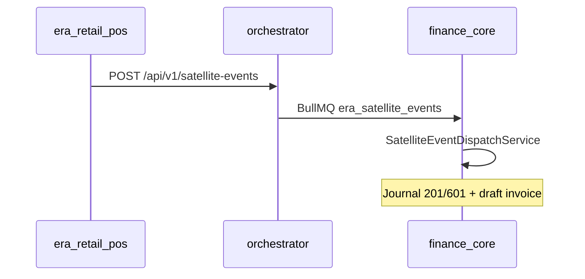

# ERA Retail POS — Product Requirements Document (PRD)

> Операционная касса и смены для SMB в Азербайджане. Один продукт — четыре **preset** (grocery, apparel, electronics, pharmacy).  
> Техническая спецификация: [TZ.md](./TZ.md) · Трекинг: [doc/DELIVERY-RETAIL.md](./doc/DELIVERY-RETAIL.md) · UI: [DESIGN.md](../DESIGN.md)

| Параметр | Значение |
|----------|----------|
| **Продукт** | ERA Retail POS (`era-retail-pos`) |
| **Entitlement** | `industry_retail_ecom` |
| **Host** | `retail.era.az` (port 3300) |
| **Аудитория** | Магазины, Instagram-продажи, аптеки, электроника, одежда (SMB AZ) |
| **Связанные системы** | `era-finance-core` (GL, склад, каталог master), `era-365-orchestrator` (SSO, events) |

**Статусы модулей (§4):** `PLANNED` · `IN_PROGRESS` · `MVP` · `DONE` · `DEFERRED`

---

## §1. Vision

### 1.1. Проблема

Малый розничный бизнес ведёт продажи в кассовых программах или Excel, а учёт (остатки, НДС, счета, e-taxes) — отдельно в ERP. Кассиру нужен быстрый POS; бухгалтерии — достоверные события продаж без ручного переноса чеков.

### 1.2. Решение

**ERA Retail POS** — сателлит «операций на точке»: смена, касса, чек, возврат, preset-специфика (вес, размер, serial, Rx/OTC). После закрытия продажи — типизированное событие в orchestrator → проводки и счёт в **era-finance-core**.

### 1.3. Ценность

| Персона | Ценность |
|---------|----------|
| **Кассир** | Быстрый чек, минимум полей, touch-friendly UI |
| **Управляющий магазином** | Смены, X/Z, контроль выручки по точке |
| **Бухгалтер / владелец** | Продажи в Finance без двойного ввода; единый контрагент и GL |

### 1.4. Explicit out-of-scope (v1)

- Полный MDM товаров, закупки, инвентаризация, FIFO-оценка — **Finance**
- Регистрация контрагента, VÖEN, WhatsApp-доставка инвойса — **Finance CRM**
- Маркетплейсы Umico/Trendyol **двусторонняя синхронизация** — Phase 3+ (отдельный интеграционный контур)
- Фискальный регистратор NBC/Cybernet production — stub/mock до интеграции с Finance/kassa
- Отдельное приложение «pharmacy» — **нет**; pharmacy = preset внутри этого repo

---

## §2. Benchmark reference (основа для PRD)

Функционал берём как **композицию best-of**, UI — по [DESIGN.md](../DESIGN.md), не клон интерфейса.

### 2.1. Общий эталон (все presets)

| Бенчмарк | Роль | Что заимствуем в ERA |
|----------|------|---------------------|
| **Lightspeed Retail** | Global SMB POS | Смена, быстрый поиск SKU, split payment, возврат по чеку |
| **Square POS** | UX эталон | Checkout flow, минималистичная касса, offline-tolerant queue (later) |
| **Shopify POS** | Omni-channel | Идея «канал продажи» в metadata чека (later) |
| **1C:Розница** | CIS учётная связка | Событие «продажа закрыта» → внешний GL (у нас — Finance worker) |
| **Kaspi / Umico** (AZ) | Маркетплейс | Только roadmap: выгрузка остатков из Finance, не дублировать каталог в POS |

### 2.2. Preset-specific benchmarks

| Preset | Primary benchmark | Что закладываем в продукт |
|--------|-------------------|---------------------------|
| **grocery** | LS Retail / GK Retail | PLU, весовой товар, быстрый скан, hotkeys, промо simple |
| **apparel** | Lightspeed variants | Размер/цвет на строке, возврат с привязкой к чеку |
| **electronics** | Square + serial tracking | IMEI/serial на строке, гарантийный stub |
| **pharmacy** | PharmacyKeeper / OTC-first | OTC корзина; Rx — restricted flow; batch/FEFO **операционная** подсказка; регуляторика — compliance later |

Детали preset: [doc/presets/](./doc/presets/)

---

## §3. Personas & roles

> RBAC control plane: [docs/SATELLITE_DOCUMENTATION.md](../docs/SATELLITE_DOCUMENTATION.md) § Identity & RBAC.

| Роль | Код | Описание |
|------|-----|----------|
| Владелец бизнеса | `BUSINESS_OWNER` | Маппинг `OWNER`/`DIRECTOR` из orchestrator; биллинг и подписка — Finance |
| Кассир | `CASHIER` | Продажи, возвраты в рамках смены |
| Старший кассир / супервайзер | `SHIFT_SUPERVISOR` | Закрытие смены, X-отчёт, void line |
| Администратор точки | `OUTLET_ADMIN` | Настройка outlet, register, preset, пользователи |
| Аудитор (SSO) | `SATELLITE_OPERATOR` | Read-only через SSO exchange (Finance/Orchestrator) |

RBAC: операционные роли в satellite DB; membership/OWNER — orchestrator; SSO — [docs/INTEGRATION_SSO_EVENTS.md](../docs/INTEGRATION_SSO_EVENTS.md).

---

## §4. Modules

| ID | Module | Benchmark | Status | Finance handoff |
|----|--------|-----------|--------|-----------------|
| M0 | Platform shell (health, SSO, layout) | Square shell | **MVP** | — |
| M1 | Tenant & outlet setup | Lightspeed locations | **PLANNED** | — |
| M2 | Register & shift (open/X/Z) | Lightspeed / 1C Z-отчёт | **MVP** | `SATELLITE_RETAIL_SHIFT_CLOSED` |
| M3 | Checkout & receipt | Square checkout | **MVP** | `SATELLITE_RETAIL_SALE_COMPLETED` |
| M4 | Payments (cash/card/split) | Lightspeed payments | **MVP** | В payload `paymentMethod` |
| M5 | Returns & void line | Square returns | **MVP** | Negative sale event (Phase 2) |
| M6 | Preset engine | Internal | **MVP** | `preset` в payload |
| M6a | Preset grocery | LS Retail | **MVP** | — |
| M6b | Preset apparel | Lightspeed variants | **MVP** | — |
| M6c | Preset electronics | Square serial | **MVP** | — |
| M6d | Preset pharmacy | PharmacyKeeper OTC | **MVP** | — |
| M7 | Product lookup (read cache) | Square catalog search | **MVP** | `GET /api/products/search` + `ProductCache` |
| M8 | Offline queue & replay | Square offline | **DEFERRED** | — |
| M9 | Fiscal device (KKM) | Local AZ providers | **DEFERRED** | Finance kassa module |
| M10 | Marketplace sync | Umico/Kaspi | **DEFERRED** | Stock in Finance |
| **M11** | **Promotions at checkout (lite)** | Lightspeed promos | **MVP** | `POST /api/receipts/:id/apply-promo` до оплаты; [`platform_loyalty`](../docs/PLATFORM_ADDONS.md) later. |
| **M12** | **Customer at POS** | Square customer on sale | **MVP** | `customerPhone`, `loyaltyRef` на `Receipt`. |

**M2 (extend):** X-отчёт по смене без Z-close — `GET /api/shifts/:id/x-report` (**MVP**).

| ID | Module | Benchmark | Status | Finance handoff |
|----|--------|-----------|--------|-----------------|
| M13 | Omnichannel OMS (BOPIS, pickup slots) | Shopify OMS | **W2 PLANNED** | [`platform_delivery`](../docs/PLATFORM_ADDONS.md) |
| M14 | Mobile stock / shelf label check | WMS lite | **W2 DEFERRED** | Inventory **Finance** |
| M15 | Auto-replenishment suggest | 1C заказ | **W2 DEFERRED** | **Finance** purchases |
| M16 | Supplier SRM / invoice match | — | **W2 DEFERRED** | **Finance** |

---

## §5. User stories

| ID | Как | Хочу | Критерии приёмки | Phase |
|----|-----|------|------------------|-------|
| R-01 | Кассир | Открыть смену на кассе | Смена OPEN, привязка к register + outlet | R1 |
| R-02 | Кассир | Пробить чек с N позициями | Receipt DRAFT → PAID, lineCount в event | R1 |
| R-03 | Кассир | Принять наличные и карту | paymentMethod в payload; сумма = amountNet | R1 |
| R-04 | Супервайзер | Закрыть смену (Z) | Смена CLOSED, итоги смены на экране | R1 |
| R-05 | Система | Отправить продажу в ERP | POST dispatch → orchestrator → Finance log `transactionId` | R1 |
| R-06 | Кассир (grocery) | Весовой товар на чек | PLU/вес в строке; preset=grocery | R2 |
| R-07 | Кассир (apparel) | Выбрать размер/цвет | Variant на строке; preset=apparel | R2 |
| R-08 | Кассир (electronics) | Ввести serial | serial обязателен для SKU-class electronics | R2 |
| R-09 | Фармацевт | Продать OTC | OTC без Rx gate; preset=pharmacy | R2 |
| R-10 | Фармацевт | Dispense Rx | Rx flow + audit log stub; без GL в satellite | R2 |
| R-11 | Супервайзер | Void строки до оплаты | Строка VOID, чек пересчитан | R2 |
| R-12 | Кассир | Возврат по чеку | Отрицательный amount / отдельный return receipt | R3 |
| R-13 | Админ | Выбрать preset для outlet | `Outlet.preset` ∈ grocery\|apparel\|electronics\|pharmacy | R1 |
| R-14 | Аудитор SSO | Войти из Finance | SSO exchange → session cookie | R0 (done) |

---

## §6. Integrations

### 6.1. Orchestrator & Finance

| Event | Contract | Когда | Finance effect |
|-------|----------|-------|----------------|
| `SATELLITE_RETAIL_SALE_COMPLETED` | [@era/contracts](../packages/era-contracts) | Чек оплачен | Revenue journal + draft AR invoice |
| `SATELLITE_RETAIL_SHIFT_CLOSED` | [@era/contracts](../packages/era-contracts) | Z-close смены | Cash reconciliation stub |

Env: `ORCHESTRATOR_EVENT_URL`, `SATELLITE_EVENT_SERVICE_TOKEN`, `ERA_SATELLITE_ORGANIZATION_ID` — см. [.env.example](./.env.example).

### 6.2. Finance boundary (summary)

Полная матрица: [doc/clone-spec/01-finance-boundary.md](./doc/clone-spec/01-finance-boundary.md)

| В Retail POS | В Finance |
|--------------|-----------|
| Чек, смена, preset UX | Каталог, цены master, остатки |
| Локальный кэш SKU (read) | Product MDM, warehouse |
| Событие продажи | GL, НДС, e-taxes, счёт-фактура |

### 6.3. SSO

- Issuer: orchestrator / Finance control plane
- Consumer: `POST /api/auth/sso/exchange` (HMAC `ERA_SSO_SHARED_SECRET`)

---

## §7. Release phases

| Phase | Scope | DELIVERY stage | Target |
|-------|--------|----------------|--------|
| **R0** | Scaffold, SSO, health, event stub | Stage 0–1 (partial) | Done |
| **R1** | Shift + checkout + sale event E2E | Stage 2–3 | MVP go-live одной точки |
| **R2** | 4 presets (grocery…pharmacy) | Stage 4 | Nafta/UAT retail pilot |
| **R3** | Returns, void, shift closed event | Stage 5 | |
| **R4** | Offline, KKM, marketplace | Stage 6+ | DEFERRED |

---

## §8. Changelog

| Date | Version | Note |
|------|---------|------|
| 2026-05-23 | 0.1 | Initial scaffold |
| 2026-05-24 | 1.0 | Full PRD: benchmarks, modules, stories, phases |
| 2026-05-25 | 1.1 | SP1: R2 preset config API, R3 void/return routes, shift close event dispatch |
| 2026-05-25 | 1.2 | SW1: ReceiptLine preset fields + validation, void line API, return event dispatch, preset-aware `/pos` |
| 2026-05-28 | 1.3 | Enrichment backlog: M11 promotions at checkout, M12 customer at POS, M7/M2 extend — [MODULES_CATALOG](../docs/MODULES_CATALOG.md) |
| 2026-05-28 | 1.4 | W2 modules M13–M16 (Gemini retail ERP) |
